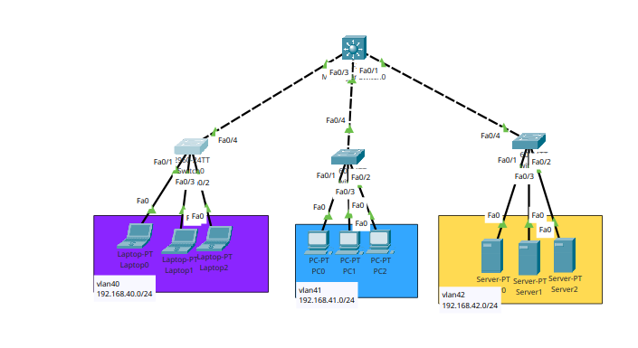

# Inter Vlan routing




## Setting on `core` swtich
```
int range fa0/1-3
switchport trunk encapsulation dot1q
switchport mode trunk

vlan 40
vlan 41
vlan 42
do show vlan bri


int vlan 40
ip address 192.168.40.254 255.255.255.0
do show ip int bri


int vlan 41
ip address 192.168.41.254 255.255.255.0
do show ip int bri

int vlan 42
ip address 192.168.42.254 255.255.255.0
do show ip int bri


# enable dhcp
ip dhcp pool vlan40
network 192.168.40.254 255.255.255.0
dns-server 192.168.40.254
default-router 192.168.40.254

exit
ip dhcp pool vlan41
network 192.168.41.254 255.255.255.0
dns-server 192.168.41.254
default-router 192.168.41.254


ip dhcp excluded-address 192.168.40.250 192.168.40.254
ip dhcp excluded-address 192.168.41.250 192.168.41.254


ip routing
```

## setting on `swtich` left

```
vlan 40
vlan 41
vlan 42

int range fa0/1-3
switchport access vlan 40
switchport mode access


# shutdown all unused port
int range fa 0/5-24 , gig 0/1-2
shutdown
do show ip int bri

do show vlan bri
do show run


```
## setting on `swtich` middle

```
vlan 40
vlan 41
vlan 42

int range fa0/1-3
switchport access vlan 40
switchport mode access


int range fa 0/5-24 , gig 0/1-2
shutdown
do show ip int bri


do show vlan bri
do show run
```


## setting on `swtich` left

```
vlan 40
vlan 41
vlan 42

int range fa0/1-3
switchport access vlan 40
switchport mode access

int range fa 0/5-24 , gig 0/1-2
shutdown
do show ip int bri


do show vlan bri
do show run
```