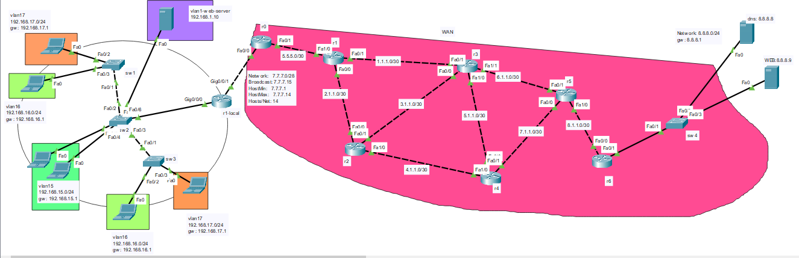

# NAT(Network Address Translate)

**Network Address Translation (NAT)** is a process of changing one or more local private IP addresses into a global public IP address. NAT is used to combat the depletion of IPv4 addresses and provide safe access to the Internet. NAT works on a router or firewall to protect private networks. All the devices in the local network have different private IP addresses, while the public IP address they are using can be the same one. NAT firewalls are used to ensure local network security and protect the data on your local devices. There are two types of NAT: **Full NAT** and **1:1 NAT** . 

(1) What Is NAT and What Are the Benefits of NAT Firewalls?. https://community.fs.com/article/what-is-nat-and-what-are-the-benefits-of-nat-firewalls.html.





# SW1
```
hostname SW1
vlan 15
vlan 16
vlan 17


interface fastEthernet 0/2
switchport mode access
switchport access vlan 17
exit

interface fastEthernet 0/3
switchport mode access
switchport access vlan 16
exit

interface fastEthernet 0/1
switchport mode trunk
switchport trunk allowed vlan 15
switchport trunk allowed vlan add 16
switchport trunk allowed vlan add 17
switchport trunk allowed vlan add 1


```


# SW2

```
hostname SW2
vlan 15
vlan 16
vlan 17


interface fastEthernet 0/1
switchport mode access
switchport access vlan 15
exit

interface fastEthernet 0/4
switchport mode access
switchport access vlan 15
exit

interface range fastEthernet 0/2-3
switchport mode trunk
switchport trunk allowed vlan 15
switchport trunk allowed vlan add 16
switchport trunk allowed vlan add 17
switchport trunk allowed vlan add 1
exit


interface range fastEthernet 0/5
switchport mode trunk
switchport trunk allowed vlan 15
switchport trunk allowed vlan add 16
switchport trunk allowed vlan add 17
switchport trunk allowed vlan add 1

```


# SW3

```
hostname SW3
vlan 15
vlan 16
vlan 17


interface fastEthernet 0/3
switchport mode access
switchport access vlan 17
exit

interface fastEthernet 0/2
switchport mode access
switchport access vlan 16
exit

interface range fastEthernet 0/1
switchport mode trunk
switchport trunk allowed vlan 15
switchport trunk allowed vlan add 16
switchport trunk allowed vlan add 17
switchport trunk allowed vlan add 1
exit


```

# R1-local
```
hostname R1-local
interface gigabitEthernet 0/0/0
no sh
exit


interface gigabitEthernet 0/0/0.15
encapsulation dot1Q 15
ip address 192.168.15.1 255.255.255.0
exit

interface gigabitEthernet 0/0/0.16
encapsulation dot1Q 16
ip address 192.168.16.1 255.255.255.0
exit

interface gigabitEthernet 0/0/0.17
encapsulation dot1Q 17
ip address 10.10.17.1 255.255.255.0
exit


interface gigabitEthernet 0/0/0.1
encapsulation dot1Q 1
ip address 192.168.1.1 255.255.255.0
exit


ip dhcp pool vlan15
network 192.168.15.0 255.255.255.0
default-router 192.168.15.1
dns-server 8.8.8.8
exit


ip dhcp pool vlan17
network 10.10.17.0 255.255.255.0
default-router 10.10.17.1
dns-server 8.8.8.8
exit


ip dhcp pool vlan16
network 192.168.16.0 255.255.255.0
default-router 192.168.16.1
dns-server 8.8.8.8
exit


ip dhcp excluded-address 192.168.15.1 192.168.15.20
ip dhcp excluded-address 192.168.16.1 192.168.16.20
ip dhcp excluded-address 10.10.17.1 10.10.17.20


interface gigabitEthernet 0/0/1
no sh
ip address 7.7.7.2 255.255.255.240
exit


ip route 0.0.0.0 0.0.0.0 7.7.7.1


# NAT configuration


interface range gigabitEthernet 0/0/0.15
ip nat inside

interface range gigabitEthernet 0/0/0.16
ip nat inside

interface range gigabitEthernet 0/0/0.17
ip nat inside

interface range gigabitEthernet 0/0/0.1
ip nat inside

interface gigabitEthernet 0/0/1
ip nat outside

# one ip
ip nat inside source static 192.168.16.22 7.7.7.2
ip nat inside source static 192.168.15.22 7.7.7.3


# PAT configuration

interface range gigabitEthernet 0/0/0.15
ip nat inside

interface range gigabitEthernet 0/0/0.16
ip nat inside

interface range gigabitEthernet 0/0/0.17
ip nat inside

interface gigabitEthernet 0/0/1
ip nat outside


ip access-list standard vlan15
permit 192.168.15.0 0.0.0.255
exit

ip nat inside source list vlan15 interface gigabitEthernet 0/0/1

ip access-list standard vlan17
permit 10.10.17.0 0.0.0.255
exit
ip nat inside source list vlan17 interface gigabitEthernet 0/0/1


ip access-list standard vlan16
permit 192.168.16.0 0.0.0.255
exit
ip nat inside source list vlan16 interface gigabitEthernet 0/0/1

ip nat inside source static 192.168.1.10 7.7.7.10


# Port forwarding
ip nat inside source static tcp 192.168.1.10 80 7.7.7.10 8090


```


# R6
```
hostname R6
interface fastEthernet 0/1
ip address 8.8.8.1 255.255.255.0
no sh

interface fastEthernet 0/0
ip address 8.1.1.1 255.255.255.252
no sh


router ospf 1
network 0.0.0.0 255.255.255.255 area 0

```


# R5
```
hostname R5
interface fastEthernet 1/0
no sh
ip address 8.1.1.2 255.255.255.252


interface fastEthernet 0/0
no sh
ip address 7.1.1.1 255.255.255.252


interface fastEthernet 0/1
no sh
ip address 6.1.1.1 255.255.255.252

router ospf 1
network 0.0.0.0 255.255.255.255 area 0
```


# R4
```
hostname R4
interface fastEthernet 0/1
ip address 7.1.1.2 255.255.255.252
exit

interface fastEthernet 0/0
ip address 5.1.1.1 255.255.255.252
no sh


interface fastEthernet 1/0
ip address 4.1.1.1 255.255.255.252
no sh


router ospf 1
network 0.0.0.0 255.255.255.255 area 0
```


# R3
```
hostname R3

interface fastEthernet 1/1
no sh
ip address 6.1.1.2 255.255.255.252
exit


interface fastEthernet 1/0
no sh
ip address 5.1.1.2 255.255.255.252
exit

interface fastEthernet 0/0
ip address 3.1.1.1 255.255.255.252
no sh


interface fastEthernet 0/1
ip address 1.1.1.1 255.255.255.252
no sh


router ospf 1
network 0.0.0.0 255.255.255.255 area 0
```


# hostname R2

```
hostname R2
interface fastEthernet 1/0
ip address 4.1.1.2 255.255.255.252
no sh


interface fastEthernet 0/1
no sh
ip address 3.1.1.2 255.255.255.252
exit

interface fastEthernet 0/0
ip address 2.1.1.1 255.255.255.252
no sh

router ospf 1
network 0.0.0.0 255.255.255.255 area 0


```


# R1
```
hostname R1
interface fastEthernet 0/1
ip address 1.1.1.2 255.255.255.252
no sh


interface fastEthernet 0/0
no sh
ip address 2.1.1.2 255.255.255.252


interface fastEthernet 1/0
ip address 5.5.5.1 255.255.255.252
no sh

router ospf 1
network 0.0.0.0 255.255.255.255 area 0

```


# R0

```
hostname R0

interface fastEthernet 0/1
ip address 5.5.5.2 255.255.255.252
no sh

interface fastEthernet 0/0
ip address 7.7.7.1 255.255.255.240


router ospf 1
network 0.0.0.0 255.255.255.255 area 0

```