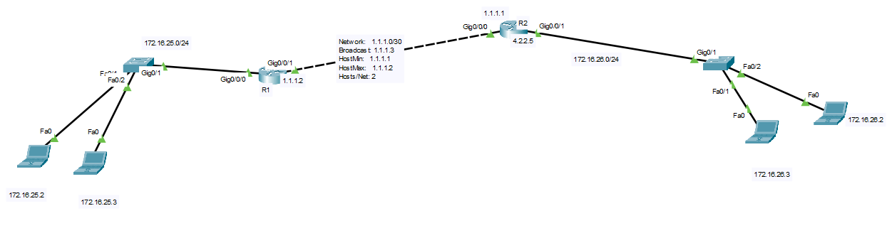

# Static route
A static route is a preconfigured pathway that a network device, such as a router or a computer, uses to forward network traffic to specific destinations in a computer network. Unlike dynamic routing protocols that automatically learn and adapt to network topology changes, static routes are manually configured by a network administrator.

Here are some key characteristics and points to consider about static routes:

1. **Manual Configuration**: Static routes are set up by network administrators and are typically not updated automatically. This means that if the network topology changes, the administrator must manually update the static routes to reflect the new network layout.

2. **Specific Destination**: Each static route defines a specific destination network or host that traffic should be directed to. For example, you can configure a static route to send all traffic destined for a particular subnet or IP address range through a specific gateway or interface.

3. **Default Route**: A special type of static route is the default route (also known as the default gateway). This route is used when a device needs to send traffic to any destination not covered by more specific static routes. It acts as a catch-all route.

4. **Administrative Distance**: In cases where multiple routes to the same destination exist (e.g., both static and dynamic routes), the router or device will choose the route with the lowest administrative distance. Static routes usually have a lower administrative distance compared to dynamic routes, which means they are preferred unless specifically overridden.

5. **Cost and Metric**: Unlike dynamic routing protocols that consider various factors (like bandwidth, latency, and hop count) to calculate the best route, static routes do not have metrics associated with them. You manually configure the route, so there's no automatic determination of which path is "best."

6. **Stability and Predictability**: Static routes are often used in scenarios where network stability and predictability are essential. They allow administrators to have precise control over routing decisions and prevent unexpected changes in network behavior.

7. **Limited Scalability**: In large and complex networks, manually managing static routes can become impractical. Dynamic routing protocols are often preferred in such cases because they can adapt to changes automatically.

In summary, static routes are a straightforward and manually configured method of routing network traffic. They are commonly used in small to medium-sized networks or for specific purposes where fine-grained control over routing is required. However, in larger and more dynamic networks, dynamic routing protocols are typically preferred for their ability to adapt to changing network conditions.


# example 1


```
# config on R1
hostname R1
interface GigabitEthernet0/0/0
ip address 172.16.25.1 255.255.255.0

interface GigabitEthernet0/0/1
ip address 1.1.1.2 255.255.255.252
exit

ip route 172.16.26.0 255.255.255.0 1.1.1.1

# config on R2
hostname R2
interface GigabitEthernet0/0/1
ip address 172.16.26.1 255.255.255.0

interface GigabitEthernet0/0/0
ip address 1.1.1.1 255.255.255.252
exit

ip route 172.16.25.0 255.255.255.0 1.1.1.2


```
