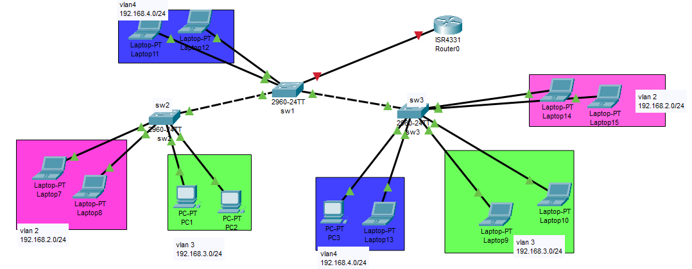
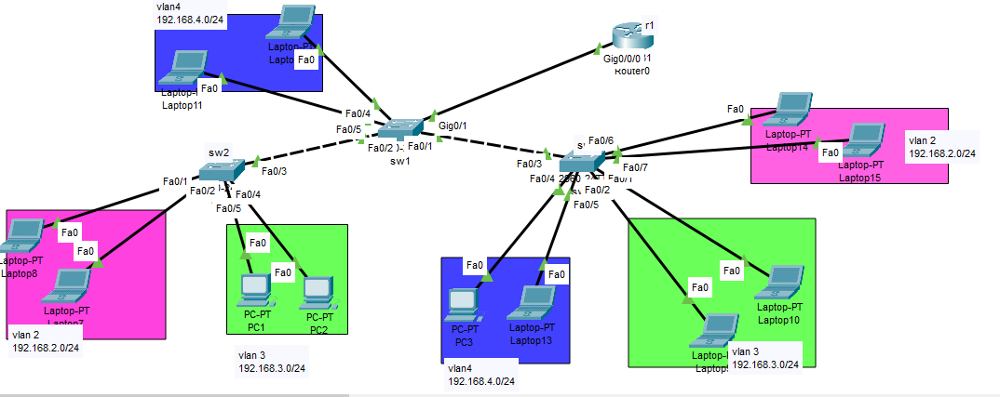

# Inter-vlan routing (ROAS)


Router on a stick (ROAS) is a method of inter-VLAN routing that uses a single physical interface on a router to connect multiple VLANs on a switch. It is a simple and cost-effective solution for small networks, but it has some drawbacks, such as limited bandwidth, security risks, and configuration complexity.

To configure ROAS, the physical interface on the router is configured as a trunk port. This allows all VLANs to be carried over the single physical link. The router then creates a subinterface for each VLAN. Each subinterface is assigned an IP address from the corresponding VLAN.

When a packet is sent from one VLAN to another, the router will remove the VLAN tag from the packet and forward it to the appropriate subinterface. The subinterface will then add the VLAN tag back to the packet before forwarding it to the destination VLAN.

ROAS is a popular method of inter-VLAN routing in small networks because it is simple to configure and does not require any additional hardware. However, it is important to be aware of the drawbacks of ROAS before implementing it in a production network.

Here are some of the advantages and disadvantages of ROAS:
### Advantages:

- Simple to configure
- Cost-effective
- Does not require any additional hardware


### Disadvantages:

- Limited bandwidth
- Security risks
- Configuration complexity


ROAS is a good option for small networks where bandwidth and security are not major concerns. However, for larger networks, it is recommended to use a more robust inter-VLAN routing solution, such as a Layer 3 switch or a dedicated routing device.







#### Configuration

```
# sw1 
hostname sw1
int rage fa 0/1-2 
switchport mode trunk
switchport trunk allowed vlan none
switchport trunk allowed vlan 1,2,3,4


int gig 0/1
switchport mode trunk
switchport trunk allowed vlan none
switchport trunk allowed vlan 1,2,3,4


vtp mode server
vtp domain test.local
vtp password iman

do show vtp status
do show vtp password

vlan 2
vlan 3
vlan 4


int range fa 0/4-5
switchport mode access
switchport access vlan 4


# sw2
hostname sw2
int rage fa 0/3 
switchport mode trunk
switchport trunk allowed vlan none
switchport trunk allowed vlan 1,2,3,4


vtp mode client
vtp domain test.local
vtp password iman


int range fa 0/1-2
switchport mode access
switchport access vlan 2


int range fa 0/4-5
switchport mode access
switchport access vlan 3


# sw3 
hostname sw3
int rage fa 0/3 
switchport mode trunk
switchport trunk allowed vlan none
switchport trunk allowed vlan 1,2,3,4


vtp mode client
vtp domain test.local
vtp password iman


interface range fastEthernet 0/4-5
switchport mode access
switchport access vlan 4


interface range fastEthernet 0/1-2
switchport mode access
switchport access vlan 3

interface range fastEthernet 0/6-7
switchport mode access
switchport access vlan 2


# r1
hostname r1
int gig 0/0/0
no sh
exit
interface gigabitEthernet 0/0/0.2
encapsulation dot1Q 2
ip add 192.168.2.1 255.255.255.0

interface gigabitEthernet 0/0/0.3
encapsulation dot1Q 3
ip add 192.168.3.1 255.255.255.0

interface gigabitEthernet 0/0/0.4
encapsulation dot1Q 4
ip add 192.168.4.1 255.255.255.0

exit

do show ip int bri

ip dhcp pool vlan2
network 192.168.2.0 255.255.255.0
default-router 192.168.2.1
exit


ip dhcp pool vlan3
network 192.168.3.0 255.255.255.0
default-router 192.168.3.1
exit


ip dhcp pool vlan4
network 192.168.4.0 255.255.255.0
default-router 192.168.4.1
exit


ip dhcp excluded-address 192.168.2.1 192.168.2.10
ip dhcp excluded-address 192.168.3.1 192.168.3.10
ip dhcp excluded-address 192.168.4.1 192.168.4.10


do sh run


```