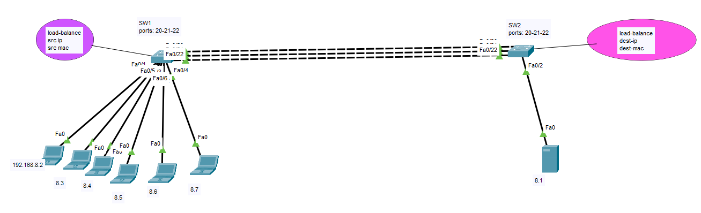
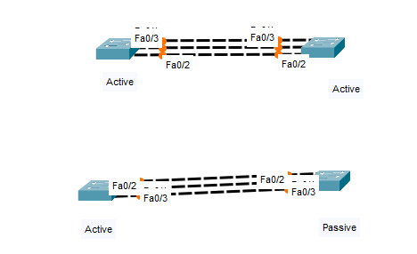

## EtherChannel

An EtherChannel, also known as a Link Aggregation Group (LAG) or Port Channel, is a technology used in computer networking to combine multiple physical Ethernet links into a single logical link. The purpose of creating an EtherChannel is to increase bandwidth, provide redundancy, and improve load balancing in a network.

1. **Increased Bandwidth:** By bundling multiple physical links together, an EtherChannel increases the available bandwidth between two devices. This aggregated bandwidth can be used to support higher data transfer rates and accommodate increased network traffic.

2. **Load Balancing:** EtherChannels distribute traffic across the member links, ensuring that no single link becomes a bottleneck. Load balancing algorithms, such as source/destination IP address or MAC address, can be configured to evenly distribute traffic.

3. **Redundancy:** EtherChannels can provide redundancy by allowing one or more of the member links to fail without disrupting network connectivity. If one link in the channel fails, traffic automatically shifts to the remaining active links.

4. **Link Resilience:** EtherChannel enhances network reliability. When a physical link experiences temporary issues like momentary outages or high error rates, EtherChannel can continue to function using the remaining links.

5. **Simplified Configuration:** Configuring EtherChannels typically involves grouping multiple physical links together into a logical interface. This simplifies network management and reduces the number of configurations needed for individual links.

6. **EtherChannel Protocols:** Several protocols can be used to negotiate and manage EtherChannels. The most common is Link Aggregation Control Protocol (LACP, IEEE 802.3ad), which dynamically establishes and maintains EtherChannels between connected devices. Cisco's proprietary Port Aggregation Protocol (PAgP) is another option.

7. **Supported Devices:** EtherChannels are commonly used between switches, routers, and servers. They are particularly useful in environments with high network traffic, such as data centers.

8. **Types of EtherChannels:** EtherChannels can be configured in different modes, including "on," "active," and "passive." The mode determines how the channel is formed. For example, in "active" mode, LACP actively negotiates the EtherChannel with the remote device.

Overall, EtherChannels are a valuable tool for optimizing network performance, improving fault tolerance, and simplifying network management in environments where high availability and increased bandwidth are critical.





# Config
```
# SW1

hostname SW1
interface range fastEthernet 0/20-22
sh
channel-group 1 mode on
do sho ip int bri


# SW2
hostname SW2
interface range fastEthernet 0/20-22
sh
channel-group 1 mode on
do sh ip int bri


# SW1
interface range fastEthernet 0/20-22
no sh

# SW2
interface range fastEthernet 0/20-22
no sh


# sw1 or sw2
do show etherchannel summary
do show eth load-balance


# SW1
port-channel load-balance src-ip


# SW2
port-channel load-balance dst-ip


```





# Config LACP


```
# SW1

hostname SW1
interface range fastEthernet 0/20-22
sh
channel-group 1 mode active
do sho ip int bri


# SW2
hostname SW2
interface range fastEthernet 0/20-22
sh
channel-group 1 mode passive
do sh ip int bri


# SW1
interface range fastEthernet 0/20-22
no sh

# SW2
interface range fastEthernet 0/20-22
no sh


# sw1 or sw2
do show etherchannel summary
do show eth load-balance


# SW1
port-channel load-balance src-ip


# SW2
port-channel load-balance dst-ip


```


# Number of Port
EtherChannel does not inherently distinguish between even or odd numbers of physical links. It can be configured with any number of links, and the number of links used in an EtherChannel is typically chosen based on the network's requirements, available resources, and the capabilities of the networking equipment.

Common configurations include:

* `2-Port EtherChannel:` This is often referred to as a "2-link EtherChannel" and is the most basic form of EtherChannel, providing redundancy and increased bandwidth.

* `4-Port EtherChannel:` A "4-link EtherChannel" is used when more bandwidth is required, and redundancy is still important.

* `8-Port EtherChannel:` For even higher bandwidth requirements, an "8-link EtherChannel" might be used.

* `Odd-Number Port EtherChannel:` While less common, there's no technical limitation against creating EtherChannels with odd numbers of ports. For example, you can create a 3-link EtherChannel if it fits your specific requirements.

The choice of how many links to bundle into an EtherChannel depends on your network design, the capabilities of your networking equipment, and your performance and redundancy needs. Always consult your specific network hardware and software documentation for guidance on how to configure EtherChannels based on your particular requirements.