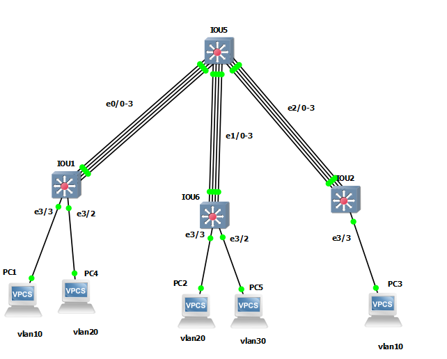

# Ether-channel
## Example




## SW1
```
interface range ethernet 0/0-3
channel-protocol lacp
channel-group 1 mode active
do sh etherchannel
exit


port-channel load-balance src-dst-mac


vlan 10,20,30
exit
interface ethernet 3/3
switchport mode access
switchport nonegotiate
switchport access vlan 10

interface ethernet 3/2
switchport mode access
switchport nonegotiate
switchport access vlan 20


int port-channel 1
switchport trunk encapsulation dot1q
switchport mode trunk
switchport nonegotiate


```

## SW5

```
interface range ethernet 0/0-3
channel-protocol lacp
channel-group 1 mode passive


interface range ethernet 1/0-3
channel-protocol pagp
channel-group 2 mode desirable non-silent


interface range ethernet 2/0-3
channel-protocol lacp
channel-group 3 mode active


sh etherchannel summary
sh interfaces port-channel 1
sh lacp counters
sh pagp counters
sh lacp neighbor
sh lacp internal


interface range port-channel 1 -3
switchport trunk encapsulation dot1q
switchport mode trunk
switchport nonegotiate


interface vlan 10
ip address 10.10.10.1 255.255.255.0
no sh


interface vlan 20
ip address 10.10.20.1 255.255.255.0
no sh

interface vlan 30
ip address 10.10.30.1 255.255.255.0
no sh


ip routing


```


## SW6

```


interface range ethernet 1/0-3
channel-protocol pagp
channel-group 2 mode auto non-silent


int port-channel 2
switchport trunk encapsulation dot1q
switchport mode trunk
switchport nonegotiate


vlan 10,20,30
exit
interface ethernet 3/3
switchport mode access
switchport nonegotiate
switchport access vlan 20

interface ethernet 3/2
switchport mode access
switchport nonegotiate
switchport access vlan 30


```


## SW2
```

interface range ethernet 2/0-3
channel-protocol lacp
channel-group 1 mode passive


int port-channel 1
switchport trunk encapsulation dot1q
switchport mode trunk
switchport nonegotiate


vlan 10,20,30
exit
interface ethernet 3/3
switchport mode access
switchport nonegotiate
switchport access vlan 10


```