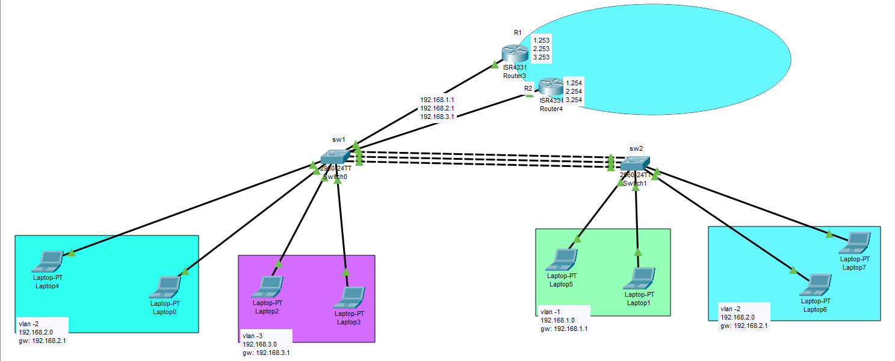

In Cisco networks, there are several gateway redundancy protocols that provide high availability and load balancing for routers and switches. Three of the most commonly used gateway redundancy protocols are Virtual Router Redundancy Protocol (VRRP), Gateway Load Balancing Protocol (GLBP), and Hot Standby Router Protocol (HSRP). Here's an overview of each of these protocols:

1. **Hot Standby Router Protocol (HSRP):**
   - HSRP is a Cisco proprietary protocol used to provide network redundancy. It allows two or more routers to work together in a group, with one router acting as the active gateway and the others as standby gateways.
   - HSRP uses a virtual IP address that is shared among the routers in the group. This virtual IP address is used as the default gateway by hosts on the local network.
   - If the active router fails, one of the standby routers will take over and become the new active router, ensuring minimal network downtime.
   - HSRP is primarily designed for use in IPv4 networks.

2. **Virtual Router Redundancy Protocol (VRRP):**
   - VRRP is a standard protocol that offers similar functionality to HSRP but is not vendor-specific. It is used to create a virtual IP address that floats between routers in a group.
   - VRRP allows for routers from different vendors to participate in the redundancy group, making it more versatile in heterogeneous network environments.
   - Like HSRP, VRRP ensures a high level of network availability and fast failover when the active router goes down.

3. **Gateway Load Balancing Protocol (GLBP):**
   - GLBP is another Cisco proprietary protocol used for gateway redundancy. It offers not only redundancy but also load balancing of traffic across multiple routers in a group.
   - Unlike HSRP and VRRP, GLBP allows multiple routers to actively forward traffic to different hosts, effectively load balancing the traffic.
   - GLBP also uses a virtual IP address, but it employs a different mechanism to assign active virtual gateways to different hosts, enhancing network performance in addition to providing redundancy.

In summary, all three of these protocols—HSRP, VRRP, and GLBP—are designed to enhance network reliability by providing gateway redundancy. The choice of which protocol to use depends on various factors, including network requirements, equipment, and vendor preferences. If you require cross-vendor compatibility, VRRP may be the preferred choice. If you need both redundancy and load balancing, GLBP might be the better option. HSRP is suitable for Cisco-specific environments and is still widely used in Cisco networks.


# Example




### SW1
```


hostname SW1

ip dhcp excluded-address 192.168.1.1 192.168.1.20
ip dhcp excluded-address 192.168.2.1 192.168.2.10
ip dhcp excluded-address 192.168.3.1 192.168.3.10

ip dhcp pool vlan1
network 192.168.1.0 255.255.255.0
efault-router 192.168.1.1

ip dhcp pool vlan2
network 192.168.2.0 255.255.255.0
default-router 192.168.2.1

ip dhcp pool vlan3
network 192.168.3.0 255.255.255.0
default-router 192.168.3.1


interface Vlan1
ip address 192.168.1.2 255.255.255.0


interface Vlan2
ip address 192.168.2.2 255.255.255.0


interface Vlan3
ip address 192.168.3.2 255.255.255.0


int range fa 0/1-3
sh
channel-group 1 mode active
switchport mode trunk


interface range FastEthernet0/4-5
 switchport access vlan 2
 switchport mode access


interface range FastEthernet0/6-7
 switchport access vlan 3
 switchport mode access


interface FastEthernet0/8
 switchport mode trunk


interface FastEthernet0/9
 switchport mode trunk


```


### SW2

```

hostname SW2

int range fa 0/1-3
sh
channel-group 1 mode passive
switchport mode trunk


interface range FastEthernet0/6-7
switchport access vlan 2
switchport mode access


```


### R1


```
hostname R1


interface GigabitEthernet0/0/0
no sh


interface GigabitEthernet0/0/0.1
encapsulation dot1Q 1
ip address 192.168.1.253 255.255.255.0
standby 1 ip 192.168.1.1


interface GigabitEthernet0/0/0.2
encapsulation dot1Q 2
ip address 192.168.2.253 255.255.255.0
standby 2 ip 192.168.2.1


interface GigabitEthernet0/0/0.3
encapsulation dot1Q 3
ip address 192.168.3.253 255.255.255.0
standby 3 ip 192.168.3.1


```


### R2

```

hostname R2

interface GigabitEthernet0/0/0
no sh

interface GigabitEthernet0/0/0.1
encapsulation dot1Q 1
ip address 192.168.1.254 255.255.255.0
standby 1 ip 192.168.1.1


interface GigabitEthernet0/0/0.2
encapsulation dot1Q 2
ip address 192.168.2.254 255.255.255.0
standby 2 ip 192.168.2.1


interface GigabitEthernet0/0/0.3
encapsulation dot1Q 3
ip address 192.168.3.254 255.255.255.0
standby 3 ip 192.168.3.1


```