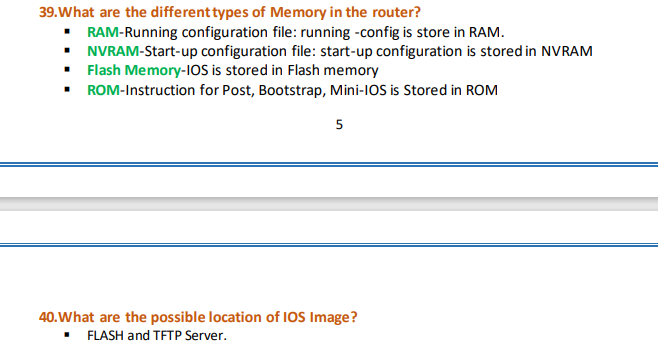
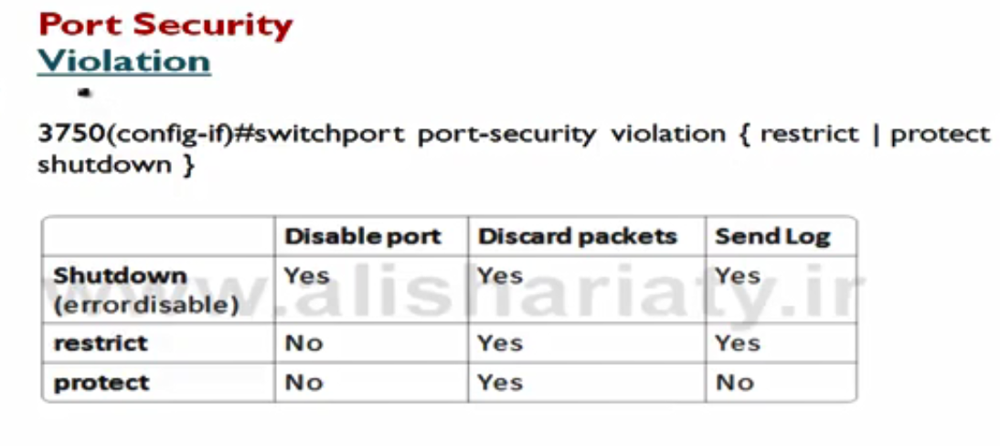
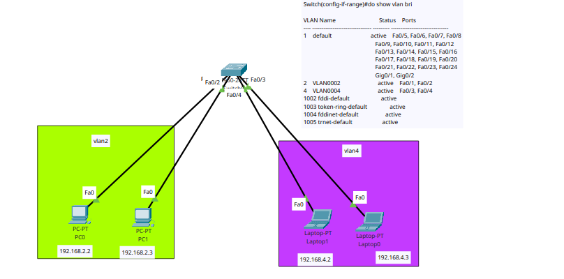

# Network 


## common configuration of cisco devices:


```
# switch between modes
---> enable ----> en

---> configure terminal ---> conf t

?  # help


```


# change hostname

```
hostname sw1   #change device name
no hostname    #reset hostname

```

 for exit when request send to the dns

```
ctrl+shift+6 

```

you can disable this feature by typing 

```
no ip domain-lookup

```

# for enable password 

```
enable password test
enable secret test
enable secret 5 $1$mERr$126VWMuSfhXn9GAlqkjPo/


```


# set password for console 
```
line console 0
password test
login


```


# how to create a user

```
username admin privilege 15 secret admin
username user1 privilege 1 secret user1

```


# save configs

```

do write
# or 
copy running-config startup-config
reload

```


# delete configs
```
erase startup-config
reload
show flash
delete vlan.dat
show flash
reload

```


```

show  running-config
do show run
show flash
```

# inspect the detail of a switch status
```
do show int fa0/1 switchport
```


# how to set IP address on router ports

```

interface gigabitEthernet 0/0/0
ip address 192.168.1.1 255.255.255.0
no sh
do show ip int bri
do show run

```


# cdp protocol, LLDP protocol
tip: cdp only works on cisco devices, but lldp works on all standard devices.


```
show cdp neighbors

```

# for using lldp, first we have to enable it
```

lldp run
show lldp neighbors

```


# how to set IP on layer3 switches
```
int fa 0/1
no switchport
ip addr 192.168.1.1 255.255.255.0

```


# how to enable telnet: 
```
username admin privilege 15 secret admin
line vty 0 2
login local

```


# how to enable ssh 
```

hostname device1
ip domain-name test
crypto key generate rsa
line vty 0 2
transport input ssh


# for show publickey
do show crypto key mypubkey rse
```


## Enable dhcp on Cisco switchs and routers 

```
# how to enable dhcp on cisco router
ip dhcp pool pool-name
network 192.168.1.0 255.255.255.0
default-router 192.168.1.1
dns-server 192.168.1.1


exit

ip dhcp excluded-address 192.168.1.1 192.168.1.10


# for showing which IP assgin to client
do show ip dhcp binding
do show ip dhcp pool

# for seeing the ip confilict in dhcp
do show ip dhcp confilict
```

# how to run dhcp on a multi-layer switch
```

ip dhcp pool <name>
network 192.168.2.0 255.255.255.0
default-router 192.168.2.1
dns-server 8.8.8.8
exit
ip dhcp exclude-address 192.168.2.1 192.168.2.30
```

# Port Security

```
show int fa 0/1
conf t  
int fa 0/1
switchport mode access
switchport port-security
switchport port-security mac-address 0003.E43B.0960

do show port-security
show port-security address
show port-security interface FastEthernet 0/1


# change the maximum default device
switchport port-security maximum 3


switchport port-security violation shutdown
switchport port-security violation restrict
switchport port-security violation protect


# clear port-security
do clear port-security configured
do clear port-security all


```


# Enable syslog sever
```
# syslog protocols works on 514/udp
logging on # enable syslog on device
logging 192.168.168.52

show logging
```


# vlan

```
vlan 10
name IT
vlan 20
name ACCOUNT


int range fa 0/1-2
switchport access vlan 10


int range fa 0/3-4
switchport access vlan 20


# choosing multiple range
int range fa 0/1-3 , fa 0/5

```




### delete vlan

```
no vlan 10

```
## Disable Debug log on console

```

no debug all

```


# set ip on layer2 switches 
```
int vlan1 
ip add 192.168.1.1 255.255.255.0
no sh
exit
ip default-gateway 192.168.1.254


```

## Backup and Restore on cisco switches and routers

```
# copy startup-config to ftp server
ip ftp username test
ip ftp password test
do copy startup-config ftp
do copy startup-config tftp

# backup 
do copy ftp running-config

```


## Allowed Vlan (trunk tunning)
```
do show int trunk
int fa 0/1 
switchport mode trunk
switchport trunk allowed vlan 6
switchport trunk allowed vlan add 5
switchport trunk allowed vlan ?

```

## VTP (VLAN TRUNKING PROTOCOLS)
VTP stands for `VLAN Trunking Protocol`. VTP is a proprietary Cisco protocol used to manage and distribute VLAN (Virtual LAN) configurations across a network of interconnected Cisco switches. The primary purpose of VTP is to simplify the administration of VLANs in a network by allowing changes made to the VLAN configuration on one Cisco switch to be automatically propagated to other switches within the same VTP domain.

```

# on vtp server
vtp mode server
vtp domain test.local
vtp password iman

do show vtp status
do show vtp password


# on vtp client
vtp mode client
vtp domain test.local
vtp password iman


```

## Switchport protected

When switchport protected is enabled on an interface, the switch will only forward traffic to that interface from other interfaces that are not configured as protected ports. All traffic between protected ports must be forwarded through a Layer 3 device, such as a router.

```
enable
configure terminal
interface GigabitEthernet0/1
switchport protected
end
copy running-config startup-config


```

## ROAS(Router On A Stick)
```
hostname r1
int gig 0/0/0
no sh
exit
interface gigabitEthernet 0/0/0.2
encapsulation dot1Q 2
ip add 192.168.2.1 255.255.255.0

interface gigabitEthernet 0/0/0.3
encapsulation dot1Q 3
ip add 192.168.3.1 255.255.255.0

interface gigabitEthernet 0/0/0.4
encapsulation dot1Q 4
ip add 192.168.4.1 255.255.255.0

```

