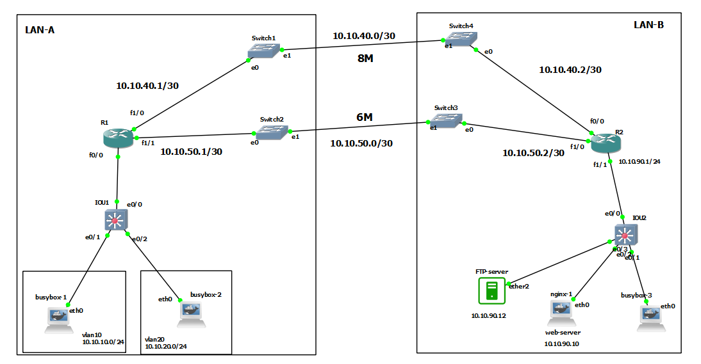

# IP-SLA : icmp-echo , http, tcp-connect



# R1

```
int fa 1/0
no sh
ip addr 10.10.40.1 255.255.255.252

int fa 1/1
no sh
ip addr 10.10.50.1 255.255.255.252

interface fastEthernet 0/0
no sh

interface fastEthernet 0/0.10
encapsulation dot1Q 10
ip addr 10.10.10.1 255.255.255.0


interface fastEthernet 0/0.20
encapsulation dot1Q 20
ip addr 10.10.20.1 255.255.255.0


ip sla 1
icmp-echo 10.10.40.2 source-interface fastEthernet 1/0
frequency 5


ip sla 2
icmp-echo 10.10.50.2 source-interface fastEthernet 1/1
frequency 5


ip sla schedule 1 start-time now life forever
ip sla schedule 2 start-time now life forever


do sh ip sla statistics 


track 1 ip sla 1
delay down 10 up 10

track 2 ip sla 2
delay down 10 up 10


ip route 10.10.90.0 255.255.255.0 fastEthernet 1/0 10.10.40.2 track 1
ip route 10.10.90.0 255.255.255.0 FastEthernet1/1 10.10.50.2 track 2

do sh ip route track-table


```

# R2

```

int fa 0/0
no sh
ip addr 10.10.40.2 255.255.255.252

int fa 1/0
no sh
ip addr 10.10.50.2 255.255.255.252

int fa 1/1
no sh
ip addr 10.10.90.1 255.255.255.0


! http sla
ip sla 1
http get http://10.10.90.10
frequency 60
ip sla schedule 1 start-time now life forever


! tcp connect sla
ip sla 2
tcp-connect 10.10.90.12 21 control disable
frequency 60
ip sla schedule 2 start-time now life forever


do sh ip sla statistics


sh tcp brief all numeric


ip sla 10
icmp-echo 10.10.40.1 source-interface fastEthernet 0/0
frequency 5


ip sla 11
icmp-echo 10.10.50.1 source-interface fastEthernet 1/0
frequency 5


ip sla schedule 10 start-time now life forever
ip sla schedule 11 start-time now life forever


do sh ip sla statistics 


track 10 ip sla 10
delay down 10 up 10

track 11 ip sla 11
delay down 10 up 10


ip route 0.0.0.0 0.0.0.0 fastEthernet 0/0 10.10.40.1 track 10
ip route 0.0.0.0 0.0.0.0 FastEthernet 1/0 10.10.50.1 track 11

do sh ip route track-table


```


# IOU1

```

int eth 0/0
switchport trunk encapsulation dot1q 
switchport mode trunk 


vlan 10,20
exit

int eth 0/1
switchport mode access 
switchport access vlan 10


int eth 0/2
switchport mode access 
switchport access vlan 20


```