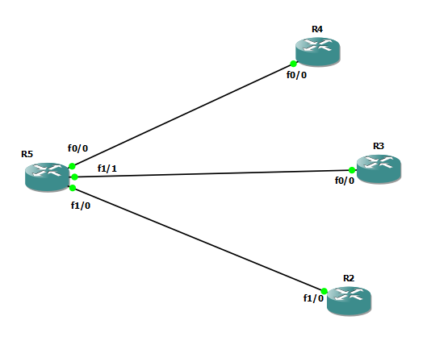

# VRF-lite




## R5

```
ip vrf vr45
description R5 to R4
exit


int fa 0/0
ip vrf forwarding vr45
ip address 10.10.45.5 255.255.255.0
no sh


ip vrf vr35
description R5 to R3
exit


int fa 1/1
ip vrf forwarding vr35
ip address 10.10.35.5 255.255.255.0
no sh


ip vrf vr25
description R5 to R2
exit

int fa 1/0
ip vrf forwarding vr25
ip address 10.10.25.5 255.255.255.0
no sh


do sh ip vrf


router eigrp my-eig-vr45
address-family ipv4 unicast vrf vr45 autonomous-system 1
network 10.10.45.5 0.0.0.0
exit
exit


do sh ip eigrp vrf vr45 neighbors
do sh ip route vrf vr45


router eigrp my-eig-vr35
address-family ipv4 unicast vrf vr35 autonomous-system 2
network 10.10.35.5 0.0.0.0
exit
exit


do sh ip eigrp vrf vr35 neighbors
do sh ip route vrf vr35


router eigrp my-eig-vr25
address-family ipv4 unicast vrf vr25 autonomous-system 1
network 10.10.25.5 0.0.0.0
exit
exit


```


## R4

```
int fa 0/0
no sh
ip address 10.10.45.4 255.255.255.0


int loopback 0
ip addr 10.10.4.1 255.255.255.0

router eigrp my-eig
address-family ipv4 unicast autonomous-system 1
network 10.10.45.4 0.0.0.0
network 10.10.4.1 0.0.0.0


```

## R3

```

int fa 0/0
no sh
ip address 10.10.35.3 255.255.255.0


int loopback 0
ip addr 10.10.3.1 255.255.255.0


router eigrp my-eig-vr35
address-family ipv4 unicast autonomous-system 2
network 10.10.35.3 0.0.0.0
network 10.10.3.1 0.0.0.0
exit
exit

```


## R2

```

int fa 1/0
no sh
ip address 10.10.25.2 255.255.255.0


int loopback 0
ip addr 10.10.2.1 255.255.255.0


router eigrp my-eig-vr25
address-family ipv4 unicast autonomous-system 1
network 10.10.25.2 0.0.0.0
network 10.10.2.1 0.0.0.0
exit
exit


```