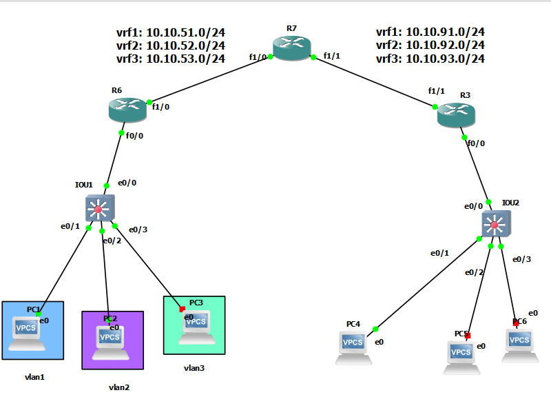

# VRF-lite



## IOU-1

```
vlan 1,2,3


interface ethernet 0/1
switchport mode access
switchport access vlan 1


interface ethernet 0/2
switchport mode access
switchport access vlan 2


interface ethernet 0/3
switchport mode access
switchport access vlan 3


do sh vlan bri

interface ethernet 0/0
switchport trunk encapsulation dot1q 
switchport mode trunk 

```


## R6

```
ip vrf vrf1
description vrf1
exit


ip vrf vrf2
description vrf2
exit


ip vrf vrf3
description vrf3
exit


do sh ip vrf


interface fastEthernet 0/0
no sh
exit

interface fastEthernet 0/0.1
no sh
encapsulation dot1Q 1
ip vrf forwarding vrf1
ip addr 10.10.61.1 255.255.255.0

interface fastEthernet 0/0.2
no sh
encapsulation dot1Q 2
ip vrf forwarding vrf2
ip addr 10.10.62.1 255.255.255.0


interface fastEthernet 0/0.3
no sh
encapsulation dot1Q 3
ip vrf forwarding vrf3
ip addr 10.10.63.1 255.255.255.0


########################################

interface fastEthernet 1/0
no sh
exit

interface fastEthernet 1/0.51
no sh
ip vrf forwarding vrf1
encapsulation dot1Q 51
ip addr 10.10.51.1 255.255.255.0

interface fastEthernet 1/0.52
no sh
ip vrf forwarding vrf2
encapsulation dot1Q 52
ip addr 10.10.52.1 255.255.255.0


interface fastEthernet 1/0.53
no sh
ip vrf forwarding vrf3
encapsulation dot1Q 53
ip addr 10.10.53.1 255.255.255.0


router eigrp my-eig-vrf1
address-family ipv4 unicast vrf vrf1 autonomous-system 1
network 10.10.51.1 0.0.0.0
network 10.10.61.1 0.0.0.0
exit
address-family ipv4 unicast vrf vrf2 autonomous-system 1
network 10.10.52.1 0.0.0.0
network 10.10.62.1 0.0.0.0
exit
address-family ipv4 unicast vrf vrf3 autonomous-system 1
network 10.10.53.1 0.0.0.0
network 10.10.63.1 0.0.0.0
exit


```


## R7

```


ip vrf vrf1
description vrf1
exit


ip vrf vrf2
description vrf2
exit


ip vrf vrf3
description vrf3
exit


interface fastEthernet 1/0
no sh
exit

interface fastEthernet 1/0.51
no sh
ip vrf forwarding vrf1
encapsulation dot1Q 51
ip addr 10.10.51.2 255.255.255.0

interface fastEthernet 1/0.52
no sh
ip vrf forwarding vrf2
encapsulation dot1Q 52
ip addr 10.10.52.2 255.255.255.0


interface fastEthernet 1/0.53
no sh
ip vrf forwarding vrf3
encapsulation dot1Q 53
ip addr 10.10.53.2 255.255.255.0

################################


interface fastEthernet 1/1
no sh
exit

interface fastEthernet 1/1.91
no sh
ip vrf forwarding vrf1
encapsulation dot1Q 91
ip addr 10.10.91.2 255.255.255.0

interface fastEthernet 1/1.92
no sh
ip vrf forwarding vrf2
encapsulation dot1Q 92
ip addr 10.10.92.2 255.255.255.0


interface fastEthernet 1/1.93
no sh
ip vrf forwarding vrf3
encapsulation dot1Q 93
ip addr 10.10.93.2 255.255.255.0


router eigrp my-eig-vrf1
address-family ipv4 unicast vrf vrf1 autonomous-system 1
network 10.10.51.2 0.0.0.0
network 10.10.91.2 0.0.0.0
exit
address-family ipv4 unicast vrf vrf2 autonomous-system 1
network 10.10.52.2 0.0.0.0
network 10.10.92.2 0.0.0.0
exit
address-family ipv4 unicast vrf vrf3 autonomous-system 1
network 10.10.53.2 0.0.0.0
network 10.10.93.2 0.0.0.0


```

## R3

```
ip vrf vrf1
description vrf1
exit


ip vrf vrf2
description vrf2
exit


ip vrf vrf3
description vrf3
exit


do sh ip vrf


interface fastEthernet 1/1
no sh
exit

interface fastEthernet 1/1.91
no sh
ip vrf forwarding vrf1
encapsulation dot1Q 91
ip addr 10.10.91.1 255.255.255.0

interface fastEthernet 1/1.92
no sh
ip vrf forwarding vrf2
encapsulation dot1Q 92
ip addr 10.10.92.1 255.255.255.0


interface fastEthernet 1/1.93
no sh
ip vrf forwarding vrf3
encapsulation dot1Q 93
ip addr 10.10.93.1 255.255.255.0


######################
interface fastEthernet 0/0
no sh
exit

interface fastEthernet 0/0.1
no sh
encapsulation dot1Q 1
ip vrf forwarding vrf1
ip addr 10.10.31.1 255.255.255.0

interface fastEthernet 0/0.2
no sh
encapsulation dot1Q 2
ip vrf forwarding vrf2
ip addr 10.10.32.1 255.255.255.0


interface fastEthernet 0/0.3
no sh
encapsulation dot1Q 3
ip vrf forwarding vrf3
ip addr 10.10.33.1 255.255.255.0


router eigrp my-eig-vrf1
address-family ipv4 unicast vrf vrf1 autonomous-system 1
network 10.10.31.1 0.0.0.0
network 10.10.91.1 0.0.0.0
exit
address-family ipv4 unicast vrf vrf2 autonomous-system 1
network 10.10.32.1 0.0.0.0
network 10.10.92.1 0.0.0.0
exit
address-family ipv4 unicast vrf vrf3 autonomous-system 1
network 10.10.33.1 0.0.0.0
network 10.10.93.1 0.0.0.0
exit
```


## IOU2

```

vlan 1,2,3


interface ethernet 0/1
switchport mode access
switchport access vlan 1


interface ethernet 0/2
switchport mode access
switchport access vlan 2


interface ethernet 0/3
switchport mode access
switchport access vlan 3


do sh vlan bri

interface ethernet 0/0
switchport trunk encapsulation dot1q 
switchport mode trunk 


```