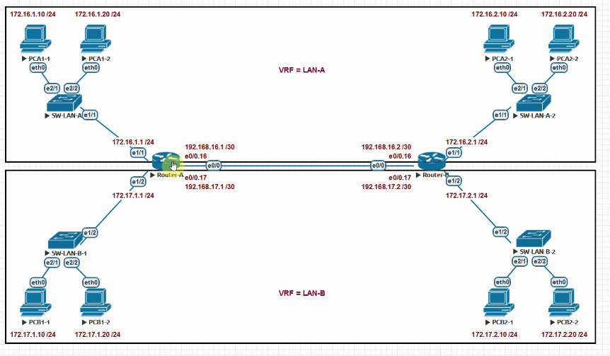

# VRF (Virtual Routing and Forwarding)



# RA 

```
# classic definition
ip vrf lan-a
exit

ip vrf lan-b
exit

int eth 0/0
no sh
exit

int ethernet0/0.16
encap dot1q 16
ip vrf forwarding lan-a
ip addr 192.168.16.1 255.255.255.252


int ethernet 0/0.17
encap dot1q 17
ip vrf forwarding lan-b 
ip addr 192.168.17.1 255.255.255.252


int eth 1/1
no sh
ip vrf forwarding lan-a
ip addr 172.16.1.1 255.255.255.0


int eth 1/2
no sh
ip vrf forwarding lan-b
ip addr 172.17.1.1 255.255.255.0


do sh ip vrf 


ip route vrf lan-a 172.16.2.0 255.255.255.0 192.168.16.2

ip route vrf lan-b 172.17.2.0 255.255.255.0 192.168.17.2


ip vrf lan-a
route-replicate from vrf lan-b unicast all

do sh ip route vrf lan-a


ip vrf lan-b
route-replicate from vrf lan-a unicast all
do sh ip route vrf lan-b


```


# RB

```
# new definition

vrf definition lan-a
address-family ipv4
exit


vrf definition lan-b
address-family ipv4
exit

int eth 0/0
no sh
exit

int ethernet0/0.16
encap dot1q 16
vrf forwarding lan-a
ip addr 192.168.16.2 255.255.255.252


int ethernet 0/0.17
encap dot1q 17
vrf forwarding lan-b 
ip addr 192.168.17.2 255.255.255.252

int eth 1/1
no sh
vrf forwarding lan-a
ip addr 172.16.2.1 255.255.255.0


int eth 1/2
no sh
vrf forwarding lan-b
ip addr 172.17.2.1 255.255.255.0


do sh ip vrf
do sh ip route vrf lan-a

do ping vrf lan-a 192.168.16.1 
ip route vrf lan-a 172.16.1.0 255.255.255.0 eth0/0.16 192.168.16.1


ip route vrf lan-b 172.17.1.0 255.255.255.0 192.168.17.1


vrf definition lan-a
address-family ipv4
route-replicate from vrf lan-b unicast all


vrf definition lan-b
address-family ipv4
route-replicate from vrf lan-a unicast all


```
 