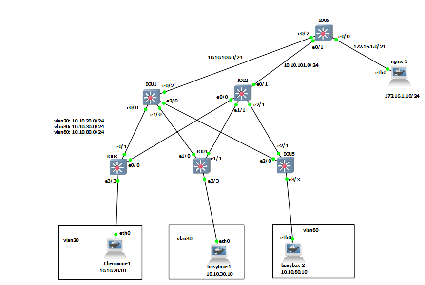

# HSRP


# IOU1

```
vlan 20,30,80

interface range ethernet 0/0, ethernet 1/0, ethernet 2/0
switchport trunk encapsulation dot1q
switchport mode trunk
switchport nonegotiate


spanning-tree vlan 80 priority 4096
spanning-tree vlan 20,30 priority 0


interface vlan 20
no sh
ip address 10.10.20.2 255.255.255.0

interface vlan 30
no sh
ip address 10.10.30.2 255.255.255.0


interface vlan 80
no sh
ip address 10.10.80.2 255.255.255.0


interface ethernet 0/2
no switchport
ip address 10.10.100.1 255.255.255.0


router ospf 1
router-id 1.1.1.1
network 10.10.100.0 0.0.0.255 area 0
network 10.10.20.0 0.0.0.255 area 0
network 10.10.30.0 0.0.0.255 area 0
network 10.10.80.0 0.0.0.255 area 0
passive-interface vlan 20
passive-interface vlan 30
passive-interface vlan 80


ip sla 1
icmp-echo 10.10.100.6 source-interface ethernet 0/2 
frequency 10
ip sla schedule 1 start-time now life forever


track 1 ip sla 1
delay down 10 up 10


interface vlan 20
standby 1 ip 10.10.20.1
standby 1 priority 120
standby 1 preempt 
standby 1 authentication md5 key-string grafana
standby 1 track 1 decrement 25


interface vlan 30
standby 1 ip 10.10.30.1
standby 1 priority 120
standby 1 preempt 
standby 1 authentication md5 key-string grafana
standby 1 track 1 decrement 25


interface vlan 80
standby 1 ip 10.10.80.1
standby 1 priority 100
standby 1 preempt 
standby 1 authentication md5 key-string grafana

```


# IOU2

```
vlan 20,30,80

interface range ethernet 0/0, ethernet 1/1, ethernet 2/1
switchport trunk encapsulation dot1q
switchport mode trunk
switchport nonegotiate


spanning-tree vlan 80 priority 0
spanning-tree vlan 20,30 priority 4096


interface vlan 20
no sh
ip address 10.10.20.3 255.255.255.0

interface vlan 30
no sh
ip address 10.10.30.3 255.255.255.0


interface vlan 80
no sh
ip address 10.10.80.3 255.255.255.0


interface ethernet 0/1
no switchport
ip address 10.10.101.1 255.255.255.0


router ospf 1
router-id 2.2.2.2
network 10.10.101.0 0.0.0.255 area 0
network 10.10.20.0 0.0.0.255 area 0
network 10.10.30.0 0.0.0.255 area 0
network 10.10.80.0 0.0.0.255 area 0
passive-interface vlan 20
passive-interface vlan 30
passive-interface vlan 80


interface vlan 20
standby 1 ip 10.10.20.1
standby 1 priority 100
standby 1 preempt 
standby 1 authentication md5 key-string grafana


interface vlan 30
standby 1 ip 10.10.30.1
standby 1 priority 100
standby 1 preempt 
standby 1 authentication md5 key-string grafana


ip sla 1
icmp-echo 10.10.101.6 source-interface ethernet 0/1 
frequency 10
ip sla schedule 1 start-time now life forever


track 1 ip sla 1
delay down 10 up 10


interface vlan 80
standby 1 ip 10.10.80.1
standby 1 priority 120
standby 1 preempt
standby 1 authentication md5 key-string grafana
standby 1 track 1 decrement 25

```


# IOU3

```
vlan 20,30,80
interface range ethernet 0/0, ethernet 0/1
switchport trunk encapsulation dot1q
switchport mode trunk
switchport nonegotiate

int eth 3/3
switchport mode access
switchport nonegotiate
spanning-tree portfast
spanning-tree bpduguard enable
switchport access vlan 20


```


# IOU4

```
vlan 20,30,80
interface range ethernet 1/0, ethernet 1/1
switchport trunk encapsulation dot1q
switchport mode trunk
switchport nonegotiate

int eth 3/3
switchport mode access
switchport nonegotiate
spanning-tree portfast
spanning-tree bpduguard enable
switchport access vlan 30


```


# IOU5

```
vlan 20,30,80
interface range ethernet 2/1, ethernet 2/0
switchport trunk encapsulation dot1q
switchport mode trunk
switchport nonegotiate

int eth 3/3
switchport mode access
switchport nonegotiate
spanning-tree portfast
spanning-tree bpduguard enable
switchport access vlan 80


```

# IOU6

```
interface ethernet 0/2
no switchport
ip address 10.10.100.6 255.255.255.0


interface ethernet 0/1
no switchport
ip address 10.10.101.6 255.255.255.0


interface ethernet 0/0
no switchport
ip address 172.16.1.1 255.255.255.0


router ospf 1
router-id 6.6.6.6
network 10.10.101.0 0.0.0.255 area 0
network 10.10.100.0 0.0.0.255 area 0
network 172.16.1.0 0.0.0.255 area 0
passive-interface ethernet 0/0


```


