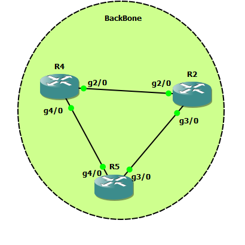

# BackBone configuration for my Lab senario




## R2

```

int gig 2/0
no sh
ip add 10.10.24.2 255.255.255.0

int gig 3/0
no sh
ip addr 10.10.25.2 255.255.255.0


router eigrp myeig
address-family ipv4 unicast as 1
network 10.10.25.2 0.0.0.0
network 10.10.24.2 0.0.0.0


```


## R5

```

int gig 3/0
no sh
ip addr 10.10.25.5 255.255.255.0


int gig 4/0
no sh
ip addr 10.10.45.5 255.255.255.0


router eigrp myeig
address-family ipv4 unicast as 1
network 10.10.25.5 0.0.0.0
network 10.10.45.5 0.0.0.0


```

## R4

```

int gig 2/0
no sh
ip addr 10.10.24.4 255.255.255.0


int gig 4/0
no sh
ip addr 10.10.45.4 255.255.255.0


router eigrp myeig
address-family ipv4 unicast as 1
network 10.10.24.4 0.0.0.0
network 10.10.45.4 0.0.0.0


```