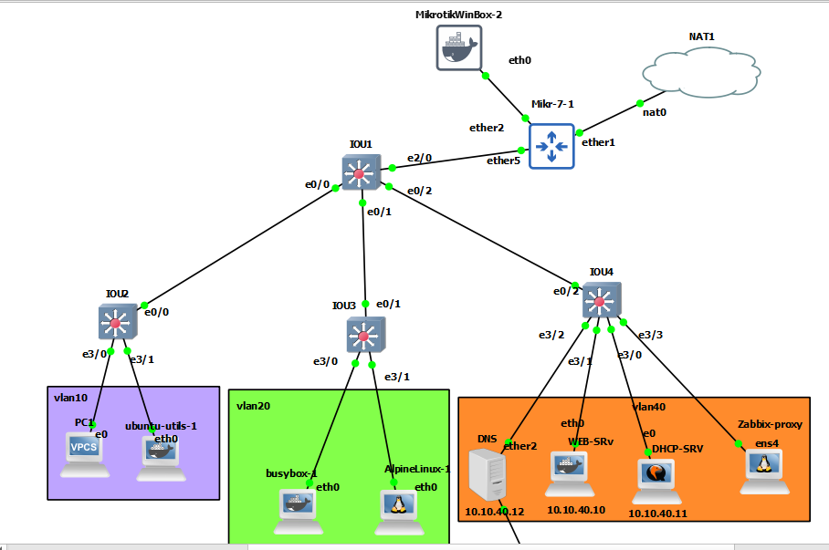

# SW1

```
interface range ethernet 0/0-2
switchport trunk encapsulation dot1q
switchport mode trunk
switchport nonegotiate


vtp domain test
vtp version 3
vtp mode server
vtp password test hidden
vtp pruning
do sh vtp password


vtp primary
vlan 10,20,30,40


int vlan 10
ip addr 10.10.10.1 255.255.255.0
ip helper-address 10.10.40.11
no sh


int vlan 20
ip addr 10.10.20.1 255.255.255.0
ip helper-address 10.10.40.11
no sh


int vlan 40
ip addr 10.10.40.1 255.255.255.0
ip helper-address 10.10.40.11
no sh

ip routing


ip access-list extended main-acl
permit udp 10.10.10.0 0.0.0.255 range 1024 65535 host 10.10.40.12 eq domain
permit icmp 10.10.10.0 0.0.0.255 host 10.10.40.10
permit tcp host 10.10.10.152 host 10.10.40.10
permit udp host 0.0.0.0 eq 68 host 255.255.255.255 eq 67
41 permit icmp 10.10.10.0 0.0.0.255 host 8.8.8.8


int vlan 10
ip access-group main-acl in


int eth 2/0
no switchport
ip addr 10.20.30.1 255.255.255.252


interface range  vlan 10,vlan 20,vlan 40
ip nat inside


interface ethernet 2/0
ip nat outside


ip access-list extended nat-acl
1 permit ip 10.10.40.0 0.0.0.255 any

ip nat inside source list nat-acl interface ethernet 2/0


ip route 0.0.0.0 0.0.0.0 10.20.30.2


! Set timezone
clock timezone tehran 3 30


! Config snmp to send to zabbix proxy 

snmp-server community iman ro

ip access-list standard snmp
permit 10.10.40.150
exit
snmp-server community iman ro snmp


! Set IP-sla

ip sla 1
icmp-echo 8.8.8.8 source-interface eth 2/0
frequency 5
ip sla schedule 1 life forever start-time now


ip sla 2
dhcp 10.10.40.11 source-ip 10.10.40.1
frequency 10
ip sla schedule 2 life forever start-time now


do sh ip sla statistics


```

# SW2

```
interface ethernet 0/0
switchport trunk encapsulation dot1q
switchport mode trunk
switchport nonegotiate


vtp domain test
vtp version 3
vtp mode client
vtp password test hidden
do sh vtp password


interface range ethernet 3/0-1
switchport mode access
switchport access vlan 10
switchport nonegotiate
no vtp


```


# SW3

```
interface ethernet 0/1
switchport trunk encapsulation dot1q
switchport mode trunk
switchport nonegotiate


interface range ethernet 3/0-1
switchport mode access
switchport access vlan 20
switchport nonegotiate
no vtp


```


# SW4

```
interface ethernet 0/2
switchport trunk encapsulation dot1q
switchport mode trunk
switchport nonegotiate


interface range ethernet 3/0-3
switchport mode access
switchport access vlan 40
switchport nonegotiate
no vtp

```


# DHCP

```
systemd-resolve --status


vim /etc/dhcp/dhcpd.conf
# add 
###################
default-lease-time 600;
max-lease-time 7200;
   
subnet 10.10.10.0 netmask 255.255.255.0 {
 range 10.10.10.150 10.10.10.200;
 option routers 10.10.10.1;
 option domain-name-servers 10.10.40.12;

}


subnet 10.10.20.0 netmask 255.255.255.0 {
 range 10.10.20.150 10.10.20.200;
 option routers 10.10.20.1;
 option domain-name-servers 10.10.40.12;
 
}


subnet 10.10.40.0 netmask 255.255.255.0 {
 range 10.10.40.150 10.10.40.200;
 option routers 10.10.40.1;
 option domain-name-servers 10.10.40.12;
 
}

###################


vim /etc/default/isc-dhcp-server
#######
INTERFACESv4="ens3"
##########


sudo systemctl restart isc-dhcp-server.service

dhcp-lease-list
```


# zabbix-proxy (debian)

```

sudo apt install sqlite3
sqlite3 --version

timedatectl set-timezone Asia/Tehran

wget https://repo.zabbix.com/zabbix/7.0/debian/pool/main/z/zabbix-release/zabbix-release_7.0-1+debian12_all.deb
dpkg -i zabbix-release_7.0-1+debian12_all.deb
apt update

apt install net-tools vim  -y


apt install zabbix-proxy-sqlite3

vim /etc/zabbix/zabbix_proxy.conf

#####
DBName=/tmp/zabbix_proxy.db
ConfigFrequency=20

####


systemctl restart zabbix-proxy
systemctl enable zabbix-proxy

```

