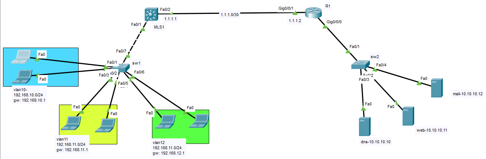

# Example2



# SW1
```
hostname SW1
vlan 10
vlan 11
vlan 12
exit


interface range fastEthernet 0/1-2
switchport mode access
switchport access vlan 10
exit


interface range fastEthernet 0/3-4
switchport mode access
switchport access vlan 11
exit


interface range fastEthernet 0/5-6
switchport mode access
switchport access vlan 12
exit


interface fastEthernet 0/7
switchport mode trunk
switchport trunk allowed vlan 10
switchport trunk allowed vlan add 11
switchport trunk allowed vlan add 12


```

# MLS
```
hostname MLS1

ip routing

vlan 10
vlan 11
vlan 12
exit

interface vlan 10
ip address 192.168.10.1 255.255.255.0
exit


interface vlan 11
ip address 192.168.11.1 255.255.255.0
exit


interface vlan 12
ip address 192.168.12.1 255.255.255.0
exit


interface fastEthernet 0/1
switchport trunk encapsulation dot1q
switchport mode trunk

switchport trunk allowed vlan 10
switchport trunk allowed vlan add 11
switchport trunk allowed vlan add 12


ip dhcp pool vlan10
network 192.168.10.0 255.255.255.0
default-router 192.168.10.1
dns-server 10.10.10.10
exit

ip dhcp pool vlan11
network 192.168.11.0 255.255.255.0
default-router 192.168.11.1
dns-server 10.10.10.10
exit

ip dhcp pool vlan12
network 192.168.12.0 255.255.255.0
default-router 192.168.12.1
dns-server 10.10.10.10
exit


ip dhcp excluded-address 192.168.10.1 192.168.10.15
ip dhcp excluded-address 192.168.11.1 192.168.11.15
ip dhcp excluded-address 192.168.12.1 192.168.12.15


interface fastEthernet 0/2
switchport
switchport trunk encapsulation dot1q
switchport mode trunk
switchport trunk allowed vlan 550
exit


vlan 550
name routing-between-mls-and-r1


exit
interface vlan 550
ip address 1.1.1.1 255.255.255.252
exit


ip route 10.10.10.0 255.255.255.0 1.1.1.2
```


# R1

```
hostname R1
interface gigabitEthernet 0/0/0
ip address 10.10.10.1 255.255.255.0


interface gigabitEthernet 0/0/1
no sh
interface gigabitEthernet 0/0/1.550
encapsulation dot1Q 550
ip address 1.1.1.2 255.255.255.252


ip route 0.0.0.0 0.0.0.0 1.1.1.1

```