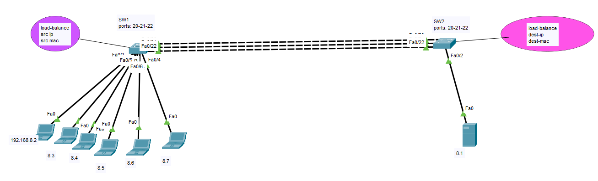
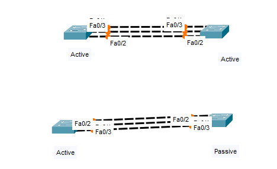

## EtherChannel

An EtherChannel, also known as a Link Aggregation Group (LAG) or Port Channel, is a technology used in computer networking to combine multiple physical Ethernet links into a single logical link. The purpose of creating an EtherChannel is to increase bandwidth, provide redundancy, and improve load balancing in a network.

1. **Increased Bandwidth:** By bundling multiple physical links together, an EtherChannel increases the available bandwidth between two devices. This aggregated bandwidth can be used to support higher data transfer rates and accommodate increased network traffic.

2. **Load Balancing:** EtherChannels distribute traffic across the member links, ensuring that no single link becomes a bottleneck. Load balancing algorithms, such as source/destination IP address or MAC address, can be configured to evenly distribute traffic.

3. **Redundancy:** EtherChannels can provide redundancy by allowing one or more of the member links to fail without disrupting network connectivity. If one link in the channel fails, traffic automatically shifts to the remaining active links.

4. **Link Resilience:** EtherChannel enhances network reliability. When a physical link experiences temporary issues like momentary outages or high error rates, EtherChannel can continue to function using the remaining links.

5. **Simplified Configuration:** Configuring EtherChannels typically involves grouping multiple physical links together into a logical interface. This simplifies network management and reduces the number of configurations needed for individual links.

6. **EtherChannel Protocols:** Several protocols can be used to negotiate and manage EtherChannels. The most common is Link Aggregation Control Protocol (LACP, IEEE 802.3ad), which dynamically establishes and maintains EtherChannels between connected devices. Cisco's proprietary Port Aggregation Protocol (PAgP) is another option.

7. **Supported Devices:** EtherChannels are commonly used between switches, routers, and servers. They are particularly useful in environments with high network traffic, such as data centers.

8. **Types of EtherChannels:** EtherChannels can be configured in different modes, including "on," "active," and "passive." The mode determines how the channel is formed. For example, in "active" mode, LACP actively negotiates the EtherChannel with the remote device.

It's important to note that both ends of the EtherChannel must be configured consistently, with the same settings for parameters like the channel group number, protocol (LACP or PAgP), and load balancing method. Proper configuration and compatibility are essential for the successful operation of EtherChannels.

Overall, EtherChannels are a valuable tool for optimizing network performance, improving fault tolerance, and simplifying network management in environments where high availability and increased bandwidth are critical.





# Config
```
# SW1

hostname SW1
interface range fastEthernet 0/20-22
sh
channel-group 1 mode on
do sho ip int bri


# SW2
hostname SW2
interface range fastEthernet 0/20-22
sh
channel-group 1 mode on
do sh ip int bri


# SW1
interface range fastEthernet 0/20-22
no sh

# SW2
interface range fastEthernet 0/20-22
no sh


# sw1 or sw2
do show etherchannel summary
do show eth load-balance


# SW1
port-channel load-balance src-ip


# SW2
port-channel load-balance dst-ip


```


## LAGP , PAgP
LAGP (Link Aggregation Group Protocol) and PAgP (Port Aggregation Protocol) are two different protocols used in Ethernet link aggregation, which is a technique that combines multiple physical Ethernet links into a single logical link to increase bandwidth and redundancy. These protocols help in the negotiation and management of aggregated links between network devices like switches and routers.

1. **LAGP (Link Aggregation Group Protocol)**:
   - LAGP is a standardization of the IEEE 802.3ad standard and is sometimes referred to as IEEE 802.3ad Link Aggregation.
   - It is a vendor-independent protocol that is commonly used in environments where devices from different manufacturers need to interoperate.
   - LAGP operates in an open standard mode, which means it can work between different vendor devices that support the IEEE 802.3ad standard.
   - It uses the Link Aggregation Control Protocol (LACP) for negotiation and dynamic management of link aggregation.
   - LACP allows devices to automatically detect and configure aggregated links based on the characteristics and capabilities of the individual links. It supports dynamic addition and removal of links from the aggregation group.

2. **PAgP (Port Aggregation Protocol)**:
   - PAgP is a Cisco proprietary protocol used for link aggregation in Cisco networking environments.
   - It is also known as Cisco-proprietary EtherChannel.
   - PAgP is specific to Cisco devices and is not interoperable with non-Cisco devices that use LAGP or LACP.
   - PAgP uses a similar approach to LACP for link negotiation and management but is designed for use within a Cisco-specific network.
   - It allows for the creation of EtherChannels (the term Cisco uses for link aggregation) by bundling multiple physical interfaces into a logical channel.

In summary, while both LAGP (LACP) and PAgP serve the same purpose of link aggregation, LAGP is an open standard protocol that can work across different vendor devices, while PAgP is a Cisco-specific protocol designed for use in Cisco networking environments. When implementing link aggregation, it's important to ensure compatibility between devices and choose the appropriate protocol accordingly.




# Config LACP


```
# SW1

hostname SW1
interface range fastEthernet 0/20-22
sh
channel-group 1 mode active
do sho ip int bri


# SW2
hostname SW2
interface range fastEthernet 0/20-22
sh
channel-group 1 mode passive
do sh ip int bri


# SW1
interface range fastEthernet 0/20-22
no sh

# SW2
interface range fastEthernet 0/20-22
no sh


# sw1 or sw2
do show etherchannel summary
do show eth load-balance


# SW1
port-channel load-balance src-ip


# SW2
port-channel load-balance dst-ip


```
