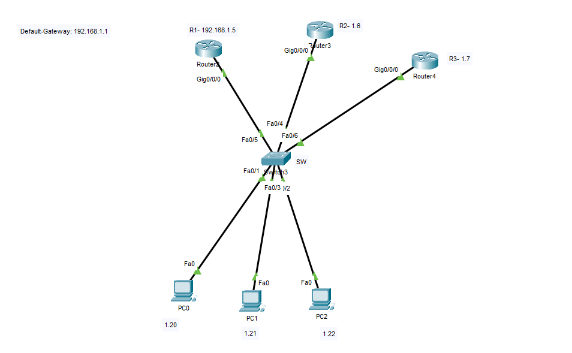

# R1
```
hostname R1
interface gigabitEthernet 0/0/0
no sh
ip address 192.168.1.5 255.255.255.0

interface gigabitEthernet 0/0/0
standby 1 ip 192.168.1.1
standby 1 priority 150
standby 1 preempt
standby 1 authentication test
```


# R2

```
hostname R2
interface gigabitEthernet 0/0/0
no sh
ip address 192.168.1.6 255.255.255.0
interface gigabitEthernet 0/0/0
standby 1 ip 192.168.1.1
standby 1 priority 140
standby 1 authentication test
```

# R3

```
hostname R3
interface gigabitEthernet 0/0/0
no sh
ip address 192.168.1.7 255.255.255.0
interface gigabitEthernet 0/0/0
standby 1 ip 192.168.1.1
standby 1 priority 130
standby 1 authentication test


exit 
do sh standby bri
do sh standby


```


# SW
```
hostname SW


```