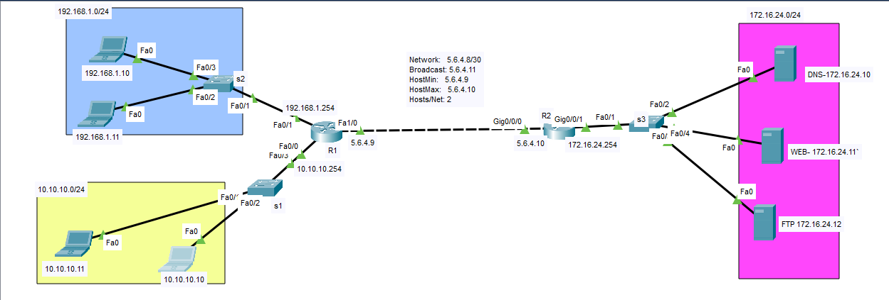

## example



```


# R1
hostname R1
interface FastEthernet0/0
ip address 10.10.10.254 255.255.255.0

interface FastEthernet0/1
ip address 192.168.1.254 255.255.255.0

interface FastEthernet1/0
ip address 5.6.4.9 255.255.255.252

ip route 172.16.24.0 255.255.255.0 5.6.4.10


# R2
hostname R2

interface GigabitEthernet0/0/0
ip address 5.6.4.10 255.255.255.252

interface GigabitEthernet0/0/1
ip address 172.16.24.254 255.255.255.0

ip route 10.10.10.0 255.255.255.0 5.6.4.9 
ip route 192.168.1.0 255.255.255.0 5.6.4.9


```

### block 192.168.1.10 for servers
```
# on R2
access-list 1 deny host 192.168.1.10
do show access-lists 


interface gigabitEthernet 0/0/1
ip access-group 1 out
do show access-lists 


```