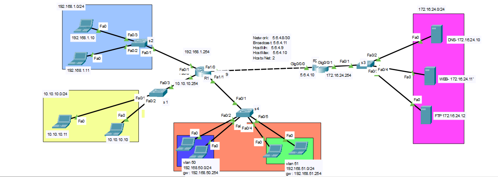

## example



```

# s4
hostname s4
vlan 50
vlan 51
interface range fastEthernet 0/2-3
switchport mode access
switchport access vlan 50

exit
interface range fastEthernet 0/4-5
switchport mode access
switchport access vlan 51


interface fastEthernet 0/1
switchport mode trunk 


# R1
hostname R1

interface fastEthernet 1/1.50
encapsulation dot1Q 50
ip address 192.168.50.254 255.255.255.0

exit

interface fastEthernet 1/1.51
encapsulation dot1Q 51
ip address 192.168.51.254 255.255.255.0


ip dhcp pool vlan50
network 192.168.50.0 255.255.255.0
default-router 192.168.50.254
dns-server 192.168.50.254


ip dhcp pool vlan51
network 192.168.51.0 255.255.255.0
default-router 192.168.51.254
dns-server 192.168.51.254


ip dhcp excluded-address 192.168.50.250 192.168.50.254
ip dhcp excluded-address 192.168.51.250 192.168.51.254


interface FastEthernet0/0
ip address 10.10.10.254 255.255.255.0

interface FastEthernet0/1
ip address 192.168.1.254 255.255.255.0

interface FastEthernet1/0
ip address 5.6.4.9 255.255.255.252

ip route 172.16.24.0 255.255.255.0 5.6.4.10


# R2
hostname R2

interface GigabitEthernet0/0/0
ip address 5.6.4.10 255.255.255.252

interface GigabitEthernet0/0/1
ip address 172.16.24.254 255.255.255.0

ip route 10.10.10.0 255.255.255.0 5.6.4.9 
ip route 192.168.1.0 255.255.255.0 5.6.4.9 
ip route 192.168.50.0 255.255.255.0 5.6.4.9 
ip route 192.168.51.0 255.255.255.0 5.6.4.9 


```

# Standard ACL

### block 192.168.1.10 trafik to servers, and allow 10.10.10.11 to servers
```
# on R2
access-list 1 deny host 192.168.1.10
access-list 1 permit host 10.10.10.11
do show access-lists 


interface gigabitEthernet 0/0/1
ip access-group 1 out
do show access-lists 


```


## Delete access list
```
interface gigabitEthernet 0/0/1
no ip access-group 1 out
exit
no access-list 1

```


## Block a range (192.168.50.0)
```
# R2
access-list 2 deny 192.168.50.0 0.0.0.255
access-list 2 permit 192.168.51.0 0.0.0.255
access-list 2  permit 192.168.1.0 0.0.0.255
access-list 2  permit 10.10.10.0 0.0.0.255

interface gigabitEthernet 0/0/0
ip access-group 2 in

```


# Standard ACL Second Way
#### Block range 192.168.1.0/24
```
# R2
ip access-list standard test
remark this access list is used for block trafik
deny 192.168.1.0 0.0.0.255
permit 192.168.50.0 0.0.0.255
permit 192.168.51.0 0.0.0.255
permit 10.10.10.0 0.0.0.255

interface gigabitEthernet 0/0/1
ip access-group test out


# add rule with hiegher priority
5 permit any

```


# Extended ACL