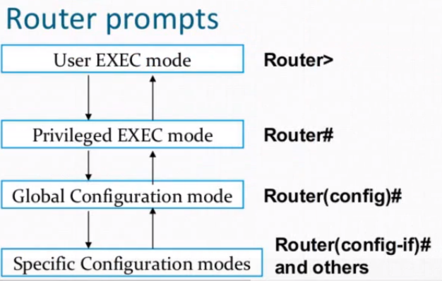

# Network 


## How to config cisco devices


```
# switch between modes
---> enable ----> en
     disable


---> configure terminal ---> conf t

?  # help


# change hostname
hostname sw1   #change device name
no hostname    #reset hostname

ctrl+shift+6 # for exit when request send to the dns or you can disable this feature by typing 

no ip domain-lookup

# for enable password 
enable password test
enable secret test
enable secret 5 $1$mERr$126VWMuSfhXn9GAlqkjPo/


# set password for console 
line console 0
password test
login


# how to create a user
username admin privilege 15 secret admin
username user1 privilege 1 secret user1


# save configs
do write
# or 
copy running-config startup-config


reload


# delete configs
erase startup-config
reload
show flash
delete vlan.dat
show flash
reload


show  running-config
do show run
show flash


# do show arp

# how to set IP address on router ports
interface gigabitEthernet 0/0/0
ip address 192.168.1.1 255.255.255.0
no sh
do show run


# cdp protocol, lldp protocol
# tip: cdp only works on cisco devices, but lldp works on all standard devices.

show cdp neighbors

# for using lldp, first we have to enable it
lldp run
show lldp neighbors


# how to set IP on layer3 switches
int fa 0/1
no switchport
ip addr 192.168.1.1 255.255.255.0


# how to enable dhcp on cisco router
ip dhcp pool pool-name
network 192.168.1.0 255.255.255.0
default-router 192.168.1.1


# how to enable telnet: 
username admin privilege 15 secret admin
line vty 0 2
login local


# how to enable ssh 
hostname device1
ip domain-name test
crypto key generate rsa
line vty 0 2
transport input ssh


# how to run dhcp on a multi-layer switch

ip dhcp pool <name>
network 192.168.2.0 255.255.255.0
default-router 192.168.2.1
dns-server 8.8.8.8
exit
ip dhcp exclude-address 192.168.2.1 192.168.2.30


# Inter Vlan routing: 
-1) use a router (ROAS --> router on a stick)
-2) use a multi-layer switch


int gig 0/0/0.10
encapsulation dot1Q 10 
ip address 192.168.10.1 255.255.255.0
exit
int gig 0/0/0.11
encapsulation dot1Q 11 
ip address 192.168.11.1 255.255.255.0


```