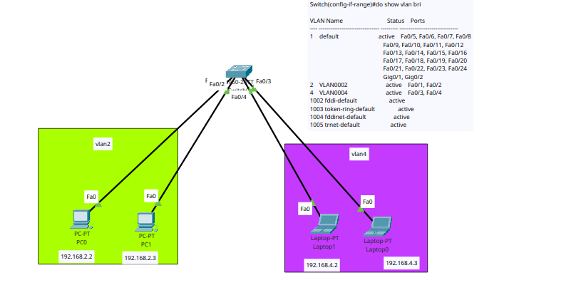

# Network 


## common configuration of cisco devices:


```
# switch between modes
---> enable ----> en

---> configure terminal ---> conf t

?  # help


```


# change hostname

```
hostname sw1   #change device name
no hostname    #reset hostname

```

 for exit when request send to the dns

```
ctrl+shift+6 

```

you can disable this feature by typing 

```
no ip domain-lookup

```

# for enable password 

```
enable password test
enable secret test
enable secret 5 $1$mERr$126VWMuSfhXn9GAlqkjPo/


```


# set password for console 
```
line console 0
password test
login


```


# how to create a user

```
username admin privilege 15 secret admin
username user1 privilege 1 secret user1

```


# save configs

```

do write
# or 
copy running-config startup-config
reload

```


# delete configs
```
erase startup-config
reload
show flash
delete vlan.dat
show flash
reload

```


```

show  running-config
do show run
show flash
```

# inspect the detail of a switch status
```
do show int fa0/1 switchport
```


# how to set IP address on router ports

```

interface gigabitEthernet 0/0/0
ip address 192.168.1.1 255.255.255.0
no sh
do show ip int bri
do show run

```


# cdp protocol, LLDP protocol
tip: cdp only works on cisco devices, but lldp works on all standard devices.


```
show cdp neighbors

```

# for using lldp, first we have to enable it
```

lldp run
show lldp neighbors

```


# how to set IP on layer3 switches
```
int fa 0/1
no switchport
ip addr 192.168.1.1 255.255.255.0

```


# how to enable telnet: 
```
username admin privilege 15 secret admin
line vty 0 2
login local

```


# how to enable ssh 
```

hostname device1
ip domain-name test
crypto key generate rsa
line vty 0 2
transport input ssh


# for show publickey
do show crypto key mypubkey rse
```


## Enable dhcp on Cisco switchs and routers 

```
# how to enable dhcp on cisco router
ip dhcp pool pool-name
network 192.168.1.0 255.255.255.0
default-router 192.168.1.1
dns-server 192.168.1.1


exit

ip dhcp excluded-address 192.168.1.1 192.168.1.10


# for showing which IP assgin to client
do show ip dhcp binding
do show ip dhcp pool

# for seeing the ip confilict in dhcp
do show ip dhcp confilict
```

# how to run dhcp on a multi-layer switch
```

ip dhcp pool <name>
network 192.168.2.0 255.255.255.0
default-router 192.168.2.1
dns-server 8.8.8.8
exit
ip dhcp exclude-address 192.168.2.1 192.168.2.30
```

# Port Security
```
show int fa 0/1
conf t
int fa 0/1
switchport mode access
switchport port-security

do show port-security
do show port-security int fa 0/1


# change the maximum default device
switchport port-security maximum 3


switchport port-security violation restrict


# clear port-security
do clear port-security all


```


# vlan

```
vlan 10
name IT
vlan 20
name ACCOUNT


int range fa 0/1-2
switchport access vlan 10


int range fa 0/3-4
switchport access vlan 20


# choosing multiple range
int range fa 0/1-3 , fa 0/5

```




### delete vlan

```
no vlan 10

```


# set ip on layer2 switches 
```
int vlan1 
ip add 192.168.1.1 255.255.255.0
no sh
exit
ip default-gateway 192.168.1.254


```

## Backup and Restore on cisco switches and routers

```
# copy startup-config to ftp server
ip ftp username test
ip ftp password test
do copy startup-config ftp
do copy startup-config tftp

# backup 
do copy ftp running-config

```


## DTP (Dynamic Trunking Protocol)

Dynamic Trunking Protocol (DTP) is a Cisco proprietary protocol used in computer networking to negotiate the creation of trunk links between switches. Trunking refers to the process of carrying multiple VLANs (Virtual Local Area Networks) over a single physical link between switches.

DTP allows switches to automatically negotiate and establish trunk links without the need for manual configuration. It operates at Layer 2 of the OSI model and uses VLAN Trunking Protocol (VTP) messages to negotiate the trunking parameters.

DTP supports several modes of operation:

- Dynamic Auto (DA): In this mode, the switch will actively negotiate to become a trunk link if the neighboring switch is set to Dynamic Desirable or Trunk mode.

- Dynamic Desirable (DD): In this mode, the switch actively attempts to negotiate and become a trunk link. It will send DTP frames to the neighboring switch, and if the neighboring switch is set to Dynamic Auto, Dynamic Desirable, or Trunk mode, a trunk link is formed.

- Trunk: In this mode, the switch will always be a trunk link without sending any DTP frames to negotiate with the neighboring switch.

- Access: In this mode, the switch will not participate in DTP negotiations and will always operate as an access link.

DTP helps simplify the configuration of trunk links in Cisco switch networks by automating the negotiation process. However, it's important to note that DTP is a Cisco proprietary protocol and is not supported by all network devices. In some cases, it may be necessary to manually configure trunk links if DTP is not supported or if there are specific security requirements for the network.

```
do show int trunk

``` 

## Allowed Vlan (trunk tunning)

```
do show int trunk
```

In Cisco networking, the "allowed VLANs in trunk" refers to the VLANs that are permitted to traverse a trunk link between switches. A trunk link is a connection between switches that carries traffic for multiple VLANs.

By default, when a trunk link is established between Cisco switches, all VLANs are allowed to pass through the trunk. However, in some cases, it may be desirable to limit the VLANs that are allowed on a trunk link for efficiency or security reasons.

To configure the allowed VLANs on a trunk link, you can use the "switchport trunk allowed vlan" command in Cisco IOS. There are two common methods of specifying the allowed VLANs:

- Specify VLAN IDs: You can explicitly list the VLAN IDs that are allowed on the trunk. For example:
    ```
    switchport trunk allowed vlan 10, 20, 30
    ```
    This command allows VLANs 10, 20, and 30 to pass through the trunk link, while blocking all other VLANs.

- Use VLAN ranges: You can specify a range of VLANs using a hyphen. For example:
    ```
    switchport trunk allowed vlan 10-20
    ```
    This command allows VLANs 10 through 20 (inclusive) to pass through the trunk link.


It's important to note that when configuring the allowed VLANs on a trunk link, you should ensure that the configuration is consistent on both ends of the trunk. In other words, the allowed VLANs on one switch should match the allowed VLANs on the other switch to avoid any connectivity issues.

By limiting the allowed VLANs on a trunk link, you can control the traffic that flows between switches, optimize bandwidth usage, and enhance network security by isolating specific VLANs from traversing the trunk.

## VTP (VLAN TRUNKING PROTOCOLS)

```


```