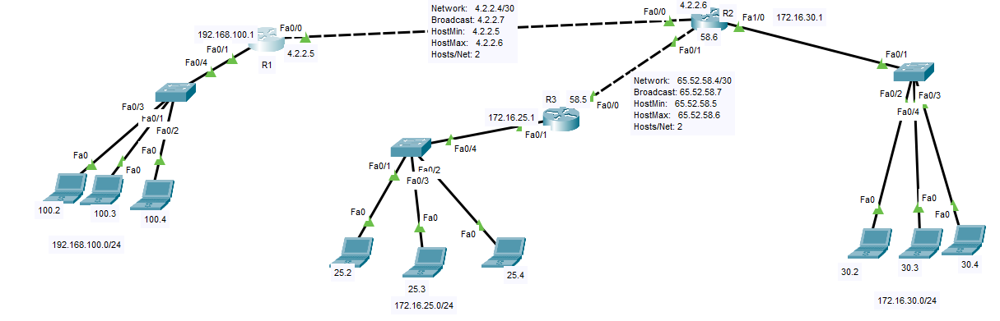

# Example 2


```
### config on router one R1
hostname R1
interface FastEthernet0/1
ip address 192.168.100.1 255.255.255.0

interface FastEthernet0/0
ip address 4.2.2.5 255.255.255.252

ip route 172.16.30.0 255.255.255.0 4.2.2.6
ip route 172.16.25.0 255.255.255.0 4.2.2.6
ip route 0.0.0.0 0.0.0.0 4.2.2.6

### config on router one R2
hostname R2
interface FastEthernet0/0
ip address 4.2.2.6 255.255.255.252

interface FastEthernet1/0
ip address 172.16.30.1 255.255.255.0

interface FastEthernet0/1
ip address 65.52.58.6 255.255.255.252


ip route 192.168.100.0 255.255.255.0 4.2.2.5
ip route 172.16.25.0 255.255.255.0 65.52.58.5 

### config on router one R3
hostname R3

interface FastEthernet0/0
ip address 65.52.58.5 255.255.255.252

interface FastEthernet0/1
ip address 172.16.25.1 255.255.255.0


ip route 172.16.30.0 255.255.255.0 65.52.58.6 
ip route 192.168.100.0 255.255.255.0 65.52.58.6 
ip route 0.0.0.0 0.0.0.0 65.52.58.6 

```