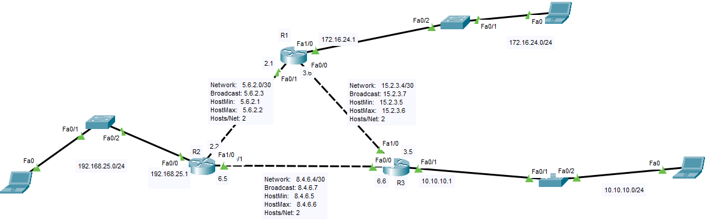
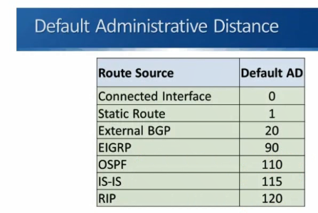

# RIP 
RIP, which stands for Routing Information Protocol, is one of the oldest and simplest routing protocols used in computer networking. It is part of the Interior Gateway Protocol (IGP) family and is designed to help routers exchange information about network routes within a local area network (LAN) or an autonomous system (AS).

Here are some key characteristics of RIP:

1. **Distance Vector Protocol:** RIP is a distance-vector routing protocol. Each router that uses RIP maintains a routing table that contains information about the network topology. Routers periodically share their routing tables with neighboring routers, allowing them to learn about available routes to different destinations.

2. **Hop Count Metric:** RIP uses a metric known as "hop count" to determine the best path to a destination network. Each hop from one router to another counts as one unit. RIP routers select the route with the fewest hops as the best route.

3. **Periodic Updates:** RIP routers send updates about their routing tables to their neighboring routers at regular intervals (typically every 30 seconds). This helps routers stay informed about network changes and adapt accordingly.

4. **Maximum Hop Limit:** RIP has a maximum hop count limit of 15 hops. Any route with a hop count of 16 or higher is considered unreachable. This limitation makes RIP less suitable for large networks.

5. **Convergence Time:** RIP can suffer from slow convergence times in the presence of network topology changes. This is because it relies on periodic updates and a simple metric, which can result in suboptimal routes until the network stabilizes.

6. **Classful Protocol:** RIP is a classful routing protocol, which means it doesn't support the subnetting and variable-length subnet masks used in classless routing protocols like OSPF or BGP. This limitation can lead to inefficient use of IP address space.

7. **Authentication:** Basic RIP does not provide built-in authentication, making it vulnerable to various security risks. However, there are extensions like RIPng (RIP Next Generation) that include authentication features.

RIP has largely been replaced by more advanced routing protocols like OSPF (Open Shortest Path First) and EIGRP (Enhanced Interior Gateway Routing Protocol) in modern networks due to their faster convergence times, support for variable-length subnet masks, and other advanced features. However, RIP is still used in some small or legacy networks where its simplicity is an advantage.


# RIP Versions
RIP  has evolved over time, resulting in different versions that offer improvements and enhancements over their predecessors. The most notable RIP versions are RIP version 1 (RIPv1) and RIP version 2 (RIPv2). Here's an overview of each version:

1. **RIP version 1 (RIPv1):**
   - **Classful Protocol:** RIPv1 is a classful routing protocol, which means it does not carry subnet mask information in its routing updates. This limitation can lead to inefficient use of IP address space and problems when routing between networks with different subnet masks.
   - **No Authentication:** RIPv1 does not provide any built-in authentication mechanisms, making it vulnerable to unauthorized router updates or route manipulation.
   - **Maximum Hop Count:** RIPv1 uses a maximum hop count limit of 15 hops for a route. If a route's hop count exceeds this limit, it is considered unreachable.
   - **Broadcast Updates:** RIPv1 sends its routing updates as broadcast messages, which can consume network bandwidth in larger networks.

2. **RIP version 2 (RIPv2):**
   - **Classless Protocol:** RIPv2 is a classless routing protocol, which means it includes subnet mask information in its routing updates. This allows for more efficient use of IP address space and greater flexibility in addressing.
   - **Authentication:** RIPv2 introduced a basic authentication mechanism using a simple plaintext password. This helps improve security by preventing unauthorized routers from participating in routing updates.
   - **Variable-Length Subnet Masks (VLSM) Support:** RIPv2 supports variable-length subnet masks, which means it can handle networks with different subnet mask lengths more effectively.
   - **Multicast Updates:** RIPv2 sends its updates using multicast instead of broadcast, reducing network traffic in larger networks.
   - **Route Tagging:** RIPv2 allows for the tagging of routes, which can be useful for policy-based routing and other advanced routing configurations.
   - **Route Summarization:** RIPv2 supports route summarization, which allows the aggregation of multiple network routes into a single summarized route, reducing the size of routing tables.

RIPv2 is generally considered an improvement over RIPv1 due to its support for classless addressing, authentication, and other enhancements. However, it's important to note that both versions of RIP are considered relatively old and are less commonly used in modern networks. More advanced routing protocols like OSPF (Open Shortest Path First) and BGP (Border Gateway Protocol) are preferred in larger and more complex networks due to their scalability, features, and faster convergence times. RIPv1 and RIPv2 are still found in some small or legacy networks where their simplicity is an advantage.

# Example


### config static route

```

# config on R1
hostname R1
interface FastEthernet0/0
ip address 15.2.3.6 255.255.255.252

interface FastEthernet0/1
ip address 5.6.2.1 255.255.255.252


interface FastEthernet1/0
ip address 172.16.24.1 255.255.255.0


ip route 192.168.25.0 255.255.255.0 5.6.2.2 
ip route 10.10.10.0 255.255.255.0 15.2.3.5 


# config on R2
hostname R2
interface FastEthernet0/0
ip address 192.168.25.1 255.255.255.0

interface FastEthernet0/1
ip address 8.4.6.5 255.255.255.252

interface FastEthernet1/0
ip address 5.6.2.2 255.255.255.252

ip route 172.16.24.0 255.255.255.0 5.6.2.1 
ip route 10.10.10.0 255.255.255.0 8.4.6.6 


# config on R3
hostname R3
interface FastEthernet0/0
ip address 8.4.6.6 255.255.255.25

interface FastEthernet0/1
ip address 10.10.10.1 255.255.255.0

interface FastEthernet1/0
ip address 15.2.3.5 255.255.255.252


ip route 172.16.24.0 255.255.255.0 15.2.3.6
ip route 192.168.25.0 255.255.255.0 8.4.6.5 


```


### RIPv1 config
```

# config on R1
hostname R1
interface FastEthernet0/0
ip address 15.2.3.6 255.255.255.252

interface FastEthernet0/1
ip address 5.6.2.1 255.255.255.252


interface FastEthernet1/0
ip address 172.16.24.1 255.255.255.0


router rip
network 5.6.2.0
network 15.2.3.4
network 172.16.24.0


# config on R2
hostname R2
interface FastEthernet0/0
ip address 192.168.25.1 255.255.255.0

interface FastEthernet0/1
ip address 8.4.6.5 255.255.255.252

interface FastEthernet1/0
ip address 5.6.2.2 255.255.255.252


router rip
network  192.168.25.0
network 5.6.2.0
network 8.4.6.4


# config on R3
hostname R3
interface FastEthernet0/0
ip address 8.4.6.6 255.255.255.25

interface FastEthernet0/1
ip address 10.10.10.1 255.255.255.0

interface FastEthernet1/0
ip address 15.2.3.5 255.255.255.252


router rip
network 8.4.6.4
network 15.2.3.4
network 10.10.10.0


```


### RIPv2 config

```

# config on R1
hostname R1
interface FastEthernet0/0
ip address 15.2.3.6 255.255.255.252

interface FastEthernet0/1
ip address 5.6.2.1 255.255.255.252


interface FastEthernet1/0
ip address 172.16.24.1 255.255.255.0

router rip
network 5.6.2.0
network 15.2.3.4
network 172.16.24.0
version 2
no auto-summary


# config on R2
hostname R2
interface FastEthernet0/0
ip address 192.168.25.1 255.255.255.0

interface FastEthernet0/1
ip address 8.4.6.5 255.255.255.252

interface FastEthernet1/0
ip address 5.6.2.2 255.255.255.252


network  192.168.25.0
network 5.6.2.0
network 8.4.6.4
version 2
no auto-summary


# config on R3
hostname R3
interface FastEthernet0/0
ip address 8.4.6.6 255.255.255.25

interface FastEthernet0/1
ip address 10.10.10.1 255.255.255.0

interface FastEthernet1/0
ip address 15.2.3.5 255.255.255.252


network 8.4.6.4
network 15.2.3.4
network 10.10.10.0
version 2
no auto-summary


```

