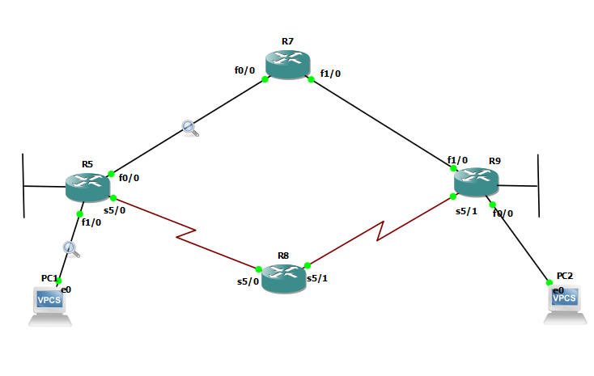

# R5
```
interface fa 1/0
ip address 10.10.5.1 255.255.255.0


interface fastEthernet 0/0
no sh
ip address 10.10.57.5 255.255.255.0
ip hello-interval eigrp 1 10
ip hold-time eigrp 1 40


interface serial 5/0
no sh
ip address 10.10.58.5 255.255.255.0

key chain R5-keychain
key 1
key-string test1
Exit
Key 2
key-string test2

do sh key chain


router eigrp 1
network 10.10.5.1 0.0.0.0
network 10.10.57.5 0.0.0.0
network 10.10.58.5 0.0.0.0
passive-interface fastEthernet 1/0


interface fastEthernet 0/0
ip authentication mode eigrp 1 md5
ip authentication key-chain eigrp 1 R5-keychain


interface serial 5/0
ip authentication mode eigrp 1 md5
ip authentication key-chain eigrp 1 R5-keychain

```


# R7
```
interface fastEthernet 0/0
no sh
ip address 10.10.57.7 255.255.255.0


int fa 1/0
no sh
ip address 10.10.79.7 255.255.255.0


router eigrp 1
network 10.10.57.7 0.0.0.0
network 10.10.79.7 0.0.0.0

do sh ip eigrp interfaces
do sh ip protocol
do sh ip eigrp neighbors
do sh ip eigrp topology
do sh ip eigrp topology all-links


key chain R7-keychain
key 1
key-string test1
Exit
Key 2
key-string test2
do sh key chain


interface fastEthernet 0/0
ip authentication mode eigrp 1 md5
ip authentication key-chain eigrp 1 R7-keychain


interface fastEthernet 1/0
ip authentication mode eigrp 1 md5
ip authentication key-chain eigrp 1 R7-keychain


```


# R8

```
interface serial 5/1
no sh
ip address 10.10.89.8 255.255.255.0


interface serial 5/0
no sh
ip address 10.10.58.8 255.255.255.0


key chain R8-keychain
key 1
key-string test1
Exit
Key 2
key-string test2
do sh key chain


router eigrp myeig-1
address-family ipv4 unicast autonomous-system 1
network 10.10.58.8 0.0.0.0
network 10.10.89.8 0.0.0.0

af-interface serial 5/0
authentication mode md5
authentication key-chain R8-keychain
hello-interval 10
hold-time 40


exit-af-interface

af-interface serial 5/1
authentication mode md5
authentication key-chain R8-keychain
exit-af-interface


```

# R9
```

int fa 1/0
no sh
ip address 10.10.79.9 255.255.255.0

interface serial 5/1
no sh
ip address 10.10.89.9 255.255.255.0


int fastEthernet 0/0
ip addr	10.10.9.1 255.255.255.0


key chain R9-keychain
key 1
key-string test1
Exit
Key 2
key-string test2
do sh key chain


router eigrp eig-1
address-family ipv4 unicast autonomous-system 1
network 10.10.79.9 0.0.0.0
network 10.10.89.9 0.0.0.0
network 10.10.9.1  0.0.0.0
af-interface fastEthernet 0/0
passive-interface
exit-af-interface

af-interface fastEthernet 1/0
authentication mode md5
authentication key-chain R9-keychain
exit-af-interface

af-interface serial 5/1
authentication mode md5
authentication key-chain R9-keychain
exit-af-interface


```