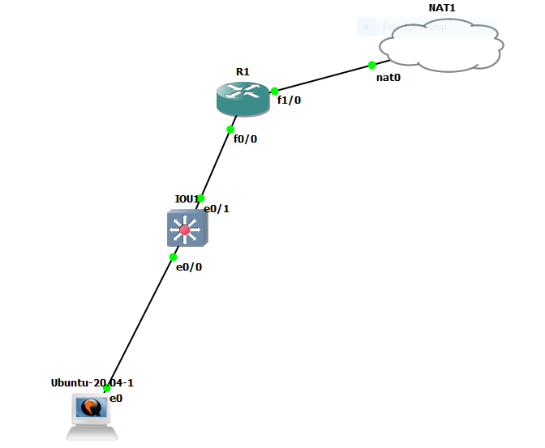

# How to backup cisco device



```


interface fastEthernet 1/0
no sh
ip address dhcp 
ip nat outside


interface fastEthernet  0/0
no sh
ip address 10.10.10.1 255.255.255.0
ip nat inside


ip dhcp pool lan
network 10.10.10.0 255.255.255.0
dns-server 8.8.8.8
efault-router 10.10.10.1


ip access-list standard nat
permit any
exit

ip nat inside source list nat interface fastEthernet 1/0


```