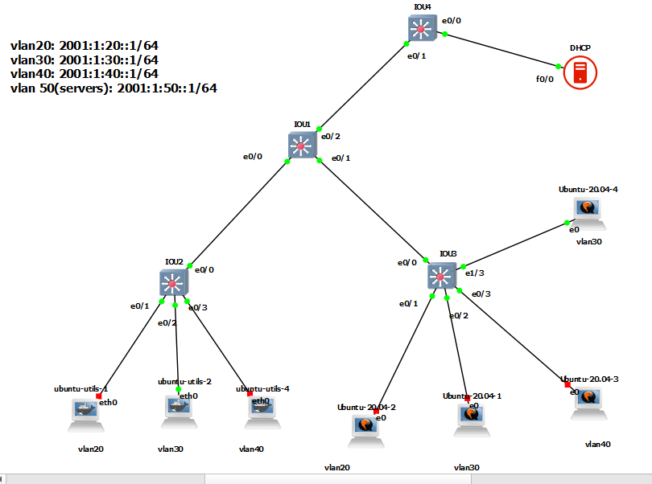

### Ubuntu as a dhcp server
```
# add below config to /etc/netplan/config.yaml
######
network:
  version: 2
  ethernets:
    ens3:
      dhcp4: no
      dhcp6: no
      addresses:
        - "2001:1:50::2/64"
#####


sudo apt update
sudo apt install isc-dhcp-server


vim  /etc/dhcp/dhcpd6.conf
# add below config to this file
#####


default-lease-time 600;
max-lease-time 7200;
log-facility local7;
subnet6 2001:1:20::/64 {
    range6 2001:1:20::2 2001:1:20::200;
    option dhcp6.name-servers 2001:4860:4860::8888, 2001:4860:4860::8844;
    option dhcp6.domain-search "example.com";
}


default-lease-time 600;
max-lease-time 7200;
log-facility local7;
subnet6 2001:1:30::/64 {
    range6 2001:1:30::2 2001:1:30::200;
    option dhcp6.name-servers 2001:4860:4860::8888, 2001:4860:4860::8844;
    option dhcp6.domain-search "example.com";
}

default-lease-time 600;
max-lease-time 7200;
log-facility local7;
subnet6 2001:1:40::/64 {
    range6 2001:1:40::2 2001:1:40::200;
    option dhcp6.name-servers 2001:4860:4860::8888, 2001:4860:4860::8844;
    option dhcp6.domain-search "example.com";
}


#####


vim /etc/default/isc-dhcp-server
## change below config
######

INTERFACESv6="eth0"
######


sudo systemctl start isc-dhcp-server
sudo systemctl enable isc-dhcp-server


```


# SW1

```
ipv6 unicast-routing


interface range ethernet 0/0-2
switchport trunk encapsulation dot1q
switchport mode trunk
do sh int trunk


vlan 20,30,40,50

interface vlan 20
ipv6 address 2001:1:20::1/64
no sh
ipv6 nd managed-config-flag
ipv6 nd other-config-flag
ipv6 dhcp relay destination 2001:1:50::2
exit


interface vlan 30
ipv6 address 2001:1:30::1/64
no sh
ipv6 nd managed-config-flag
ipv6 nd other-config-flag
ipv6 dhcp relay destination 2001:1:50::2
exit

interface vlan 40
ipv6 address 2001:1:40::1/64
no sh
ipv6 nd managed-config-flag
ipv6 nd other-config-flag
ipv6 dhcp relay destination 2001:1:50::2
exit


interface vlan 50
ipv6 address 2001:1:50::1/64
no sh
exit


```


# SW2

```

interface ethernet 0/0
switchport trunk encapsulation dot1q
switchport mode trunk

vlan 20,30,40


interface ethernet 0/1
switchport mode access
switchport access vlan 20
exit

interface ethernet 0/2
switchport mode access
switchport access vlan 30
exit

interface ethernet 0/3
switchport mode access
switchport access vlan 40
exit


```


# SW3

```

interface ethernet 0/0
switchport trunk encapsulation dot1q
switchport mode trunk

vlan 20,30,40


interface ethernet 0/1
switchport mode access
switchport access vlan 20
exit

interface ethernet 0/2
switchport mode access
switchport access vlan 30
exit

interface ethernet 0/3
switchport mode access
switchport access vlan 40
exit


interface ethernet 1/3
switchport mode access
switchport access vlan 30
exit

```

# SW4

```
interface ethernet 0/1
switchport trunk encapsulation dot1q
switchport mode trunk

vlan 50

interface ethernet 0/0
switchport mode access
switchport access vlan 50
exit


```


## Client-ubuntu:

```
systemd-resolve --status

sudo apt install network-manage
nmcli dev show | grep 'IP4.DNS'


```

