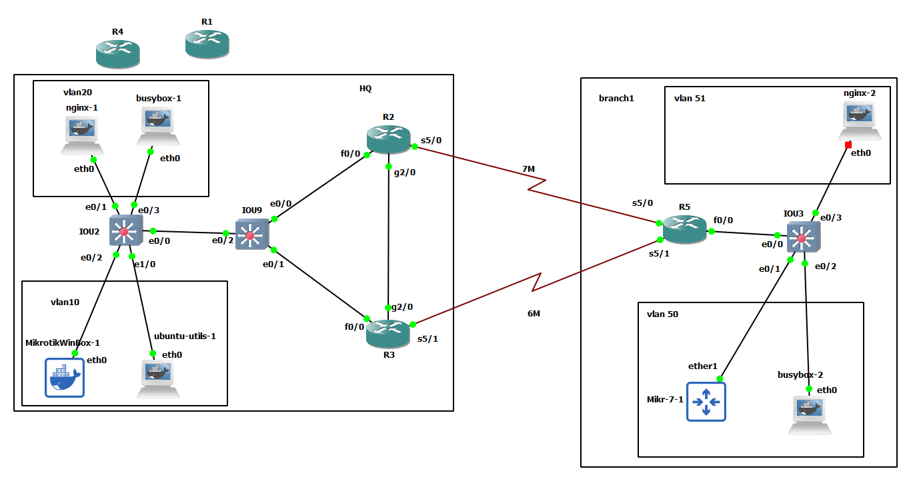

# Policy Base Routing




# R2

```
int fa 0/0
no sh
ip addr 10.10.29.2 255.255.255.0


int gig 2/0
no sh
ip addr 10.10.23.2 255.255.255.0

int seri 5/0
no sh
ip addr 10.10.25.2 255.255.255.0
bandwidth 7000


router eigrp my-eig
address-family ipv4 unicast as 1
network 10.10.23.2 0.0.0.0
network 10.10.25.2 0.0.0.0
network 10.10.29.2 0.0.0.0

```


# R3

```
int fa 0/0
no sh
ip addr 10.10.39.3 255.255.255.0


int gig 2/0
no sh
ip addr 10.10.23.3 255.255.255.0

int seri 5/1
no sh
ip addr 10.10.35.3 255.255.255.0
bandwidth 6000


router eigrp my-eig
address-family ipv4 unicast as 1
network 10.10.39.3 0.0.0.0
network 10.10.23.3 0.0.0.0
network 10.10.35.3 0.0.0.0


ip access-list extended PBR-ACL
permit ip 10.10.10.0 0.0.0.255 10.10.50.0 0.0.0.255
permit tcp 10.10.20.0 0.0.0.255 10.10.51.0 0.0.0.255 eq 80


route-map PBR-RP permit 10
match ip address PBR-ACL
set ip next-hop 10.10.35.5
exit


interface fast 0/0
ip policy route-map PBR-RP

do sh ip policy
do sh route-map


```


# IOU9

```
int eth 0/0
no sh
no switchport
ip addr 10.10.29.9 255.255.255.0


int eth 0/1
no sh
no switchport
ip addr 10.10.39.9 255.255.255.0


int eth 0/2
switchport trunk encapsulation dot1q
switchport mode trunk


vlan 10,20
exit

int vlan 20
ip addr 10.10.20.1 255.255.255.0
no sh

int vlan 10 
ip addr 10.10.10.1 255.255.255.0
no sh


router eigrp my-eig
address-family ipv4 unicast as 1
network 10.10.10.1 0.0.0.0
network 10.10.20.1 0.0.0.0
network 10.10.39.9 0.0.0.0
network 10.10.29.9 0.0.0.0

af-interface vlan 20
passive-interface
exit-af-interface 

af-interface vlan 10
passive-interface
exit-af-interface 


ip access-list extended PBR-ACL
permit ip 10.10.10.0 0.0.0.255 10.10.50.0 0.0.0.255
permit tcp 10.10.20.0 0.0.0.255 10.10.51.0 0.0.0.255 eq 80


route-map PBR-RP permit 10
match ip address PBR-ACL
set ip next-hop 10.10.39.3
exit

interface vlan 10
ip policy route-map PBR-RP


interface vlan 20
ip policy route-map  PBR-RP


do sh ip policy
do sh route-map


```


# IOU2

```


int eth 0/0
switchport trunk encapsulation dot1q
switchport mode trunk

vlan 10,20
exit


interface ethernet 0/1
switchport mode access
switchport access vlan 20


interface ethernet 0/3
switchport mode access
switchport access vlan 20


interface ethernet 0/2
switchport mode access
switchport access vlan 10


interface ethernet 1/0
switchport mode access
switchport access vlan 10
```


# R5


```


int seri 5/0
no sh
ip addr 10.10.25.5 255.255.255.0
bandwidth 7000


int seri 5/1
no sh
ip addr 10.10.35.5 255.255.255.0
bandwidth 6000


int fa 0/0
no sh

int fa 0/0.50
encapsulation dot1Q 50
ip address 10.10.50.1 255.255.255.0
no sh

int fa 0/0.51
encapsulation dot1Q 51
ip address 10.10.51.1 255.255.255.0
no sh


router eigrp my-eig
address-family ipv4 unicast as 1
network 10.10.51.1 0.0.0.0
network 10.10.50.1 0.0.0.0
network 10.10.35.5 0.0.0.0
network 10.10.25.5 0.0.0.0
af-interface fastEthernet 0/0.51
passive-interface
exit-af-interface
af-interface fastEthernet 0/0.50
passive-interface
exit-af-interface


ip access-list extended PBR-ACL
permit ip 10.10.50.0 0.0.0.255 10.10.10.0 0.0.0.255
permit tcp 10.10.51.0 0.0.0.255 eq 80 10.10.20.0 0.0.0.255 

route-map PBR-RP permit 10
match ip address PBR-ACL
set ip next-hop 10.10.35.3
exit


interface fastEthernet 0/0.50
ip policy route-map PBR-RP


interface fastEthernet 0/0.51
ip policy route-map PBR-RP

do sh ip policy
do sh route-map


```


# IOU3

```

int eth 0/0
switchport trunk encapsulation dot1q
switchport mode trunk


vlan 50,51
exit


interface ethernet 0/1
switchport mode access
switchport access vlan 50


interface ethernet 0/2
switchport mode access
switchport access vlan 50


interface ethernet 0/3
switchport mode access
switchport access vlan 51

```