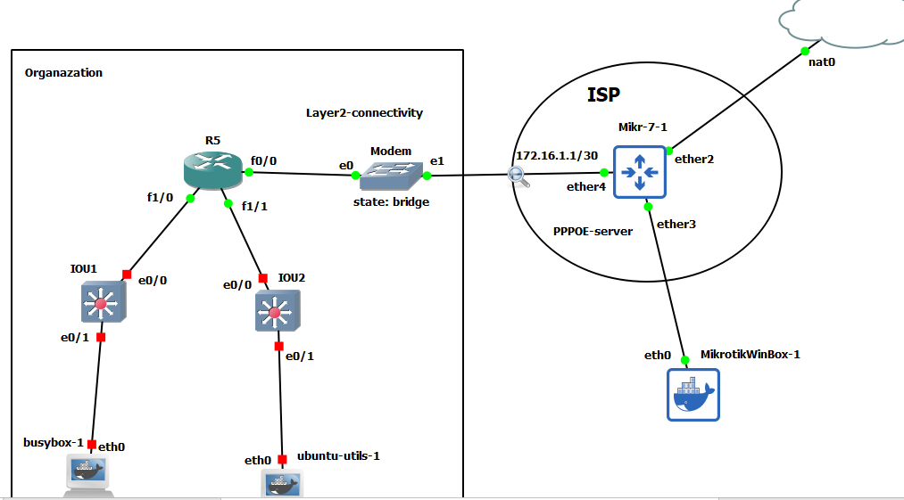

# NAT with PPPOE client on cisco router




### Mikrotik

```
/system identity
set name=Mikrotik-ISP


/ip dhcp-client
add interface=ether2


/ip firewall nat
add action=masquerade chain=srcnat out-interface=ether2


/ip pool
add name=PPPOE-POOL ranges=10.10.10.1-10.10.10.254

/ppp profile
add local-address=10.10.10.1 name=profile-PPPOE remote-address=\
    PPPOE-POOL

/interface pppoe-server server
add authentication=mschap1,mschap2 default-profile=profile-PPPOE \
    disabled=no interface=ether4 service-name=PPPOE-server


```


### R5

```
int fa 0/0
no sh
pppoe enable group global 
pppoe-client dial-pool-number 1
no cdp enable
no ip address 
exit


interface dialer 1
mtu 1492
ip address negotiated
encapsulation ppp 
dialer pool 1
ppp chap hostname test
ppp chap password test


do sh pppoe session 
do sh int dialer 1


ip route 0.0.0.0 0.0.0.0 dialer 1


int fa 1/0
no sh
ip addr 192.168.71.1 255.255.255.0
ip nat inside


int fa 1/1
no sh
ip addr 192.168.72.1 255.255.255.0
ip nat inside


int dialer 1
ip nat outside 


ip access-list standard NAT-ACL
permit 192.168.71.1 0.0.0.255
exit


ip nat inside source list NAT-ACL interface dialer 1


do sh ip nat statistics
```


# common errors

when you want to remove the nat in cisco route , sometimes it give you an error `%Dynamic mapping in use, cannot remove` , for resovling this issue: 

```
sh ip nat translation 
clear ip nat translation *

# now remove the nat
no ip nat inside source list NAT-ACL interface dialer 1
```