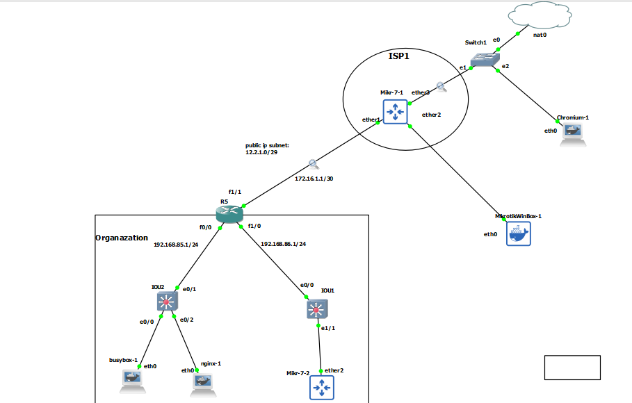

# if have a range of ip addresses



# Mikrotik ISP1

```
system/identity/set name=ISP


ip dhcp-client/add interface=ether3 add-default-route=yes use-peer-ntp=yes use-peer-dns=yes


ip address/add interface=ether1 address=172.16.1.1/30


ip firewall/nat/add chain=srcnat action=masquerade


ip route/add dst-address=12.2.1.0/29 gateway=172.16.1.2

```


# R5

```
interface fastEthernet 1/1
no sh
ip addr 172.16.1.2 255.255.255.252

ip route 0.0.0.0 0.0.0.0 172.16.1.1


int fa 1/0
no sh
ip addr 192.168.86.1 255.255.255.0


int fa 0/0
no sh 
ip addr 192.168.85.1 255.255.255.0


int fa 1/1
ip nat outside


int range fa 0/0, fa 1/0
ip nat inside


ip access-list standard NAT-ACL
permit 192.168.85.0 0.0.0.255


ip nat pool pool-1 12.2.1.0 12.2.1.7 netmask 255.255.255.248
ip nat inside source list NAT-ACL pool pool-1 overload

sh ip nat statistics 


! port forwarding
ip nat inside source static tcp 192.168.85.11 80 12.2.1.5 8080
```