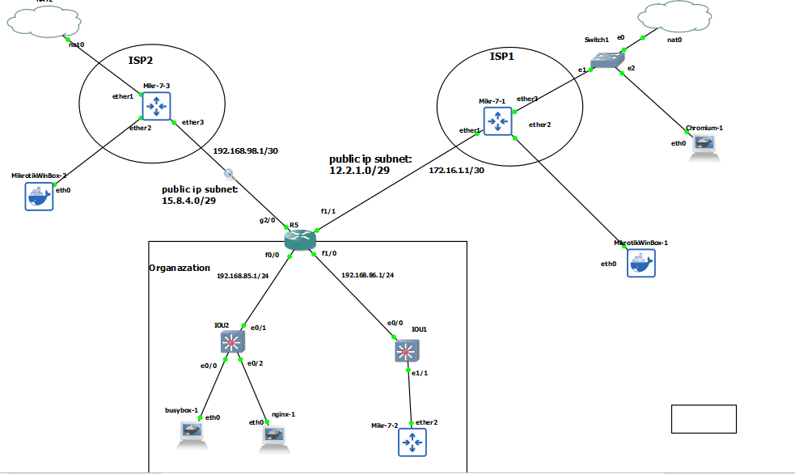

# If we have multiple internet from multiple ISP





# Mikrotik ISP1

```
system/identity/set name=ISP1


ip dhcp-client/add interface=ether3 add-default-route=yes use-peer-ntp=yes use-peer-dns=yes


ip address/add interface=ether1 address=172.16.1.1/30


ip firewall/nat/add chain=srcnat action=masquerade


ip route/add dst-address=12.2.1.0/29 gateway=172.16.1.2

```

# Mikrotik ISP2

```
system/identity/set name=ISP2


ip dhcp-client/add interface=ether1 add-default-route=yes use-peer-ntp=yes use-peer-dns=yes


ip address/add interface=ether3 address=192.168.98.1/30


ip firewall/nat/add chain=srcnat action=masquerade


ip route/add dst-address=15.8.4.0/29 gateway=192.168.98.2

```


# R5

```
interface fastEthernet 1/1
no sh
ip addr 172.16.1.2 255.255.255.252


interface gig 2/0
no sh
ip addr 192.168.98.2 255.255.255.252


int loopback 1
ip address 12.2.1.0 255.255.255.255

int loopback 2 
ip address 15.8.4.0 255.255.255.255


access-list 1 permit 12.2.1.0
access-list 2 permit 15.8.4.0


route-map isp-avalability permit 10
match ip address 1
set ip next-hop 172.16.1.1

route-map isp-avalability permit 20
match ip address 2
set ip next-hop 192.168.98.1

ip local policy route-map isp-avalability


ip sla 1
icmp-echo 9.9.9.9 source-interface loopback 1
frequency 5

ip sla 2
icmp-echo 9.9.9.9 source-interface loopback 2
frequency 5

ip sla schedule 1 start-time now life forever
ip sla schedule 2 start-time now life forever

do sh ip sla statistics

track 1 ip sla 1
delay down 15 up 15
exit	

track 2 ip sla 2
delay down 15 up 15
exit


do sh track


ip route 0.0.0.0 0.0.0.0 172.16.1.1 track 1
ip route 0.0.0.0 0.0.0.0 192.168.98.1 track 2

int range gigabitEthernet 2/0, fastEthernet 1/1
ip nat outside 


interface range fastEthernet 0/0, fastEthernet 1/0
ip nat inside


int fa 1/0
no sh
ip addr 192.168.86.1 255.255.255.0


int fa 0/0
no sh 
ip addr 192.168.85.1 255.255.255.0


ip access-list standard NAT-ACL
permit 192.168.85.0 0.0.0.255


ip nat pool ISP1-pool 12.2.1.1 12.2.1.7 netmask 255.255.255.248
ip nat pool ISP2-pool 15.8.4.1 15.8.4.7 netmask 255.255.255.248


route-map ISP1-RMAP permit 10
match ip address NAT-ACL
match interface fastEthernet 1/1


route-map ISP2-RMAP permit 10
match ip address NAT-ACL
match interface gig 2/0


ip nat inside source route-map ISP1-RMAP pool ISP1-pool overload
ip nat inside source route-map ISP2-RMAP pool ISP2-pool overload

sh ip nat statistics 


! port forwarding
ip nat inside source static tcp 192.168.85.11 80 12.2.1.5 8080
ip nat inside source static tcp 192.168.85.11 80 15.8.4.5 8080
```