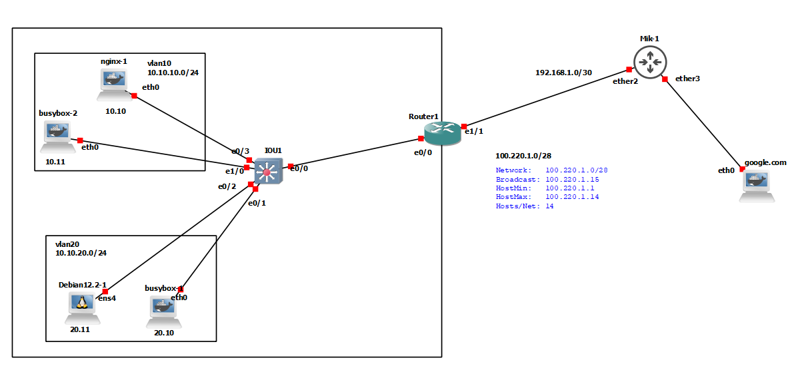

# NAT (Network Address Translation)



```


ip route 0.0.0.0 0.0.0.0 192.168.1.1

interface Ethernet1/1
 ip address 192.168.1.2 255.255.255.252
 ip nat outside


interface Ethernet0/0.10
 encapsulation dot1Q 10
 ip address 10.10.10.1 255.255.255.0
 ip nat inside

interface Ethernet0/0.20
 encapsulation dot1Q 20
 ip address 10.10.20.1 255.255.255.0
 ip nat inside


ip access-list standard NAT-ACL
 permit 10.10.10.0 0.0.0.255


ip nat inside source list NAT-ACL interface ethernet 1/1 overload		# inside = source NAT
                                                                        # Outside = DST-NAT


sh ip nat translations
sh ip nat statistics


# port-forwarding

ip nat inside source static tcp 10.10.20.10 80 172.16.1.1 6060 

ip nat inside source static tcp 10.10.20.10 80 172.16.1.1 8080
ip nat inside source static tcp 10.10.10.100 80 172.16.1.1 9090


```


### Create Pool 

```


ip route 0.0.0.0 0.0.0.0 192.168.1.1

interface Ethernet1/1
 ip address 192.168.1.2 255.255.255.252
 ip nat outside


interface Ethernet0/0.10
 encapsulation dot1Q 10
 ip address 10.10.10.1 255.255.255.0
 ip nat inside

interface Ethernet0/0.20
 encapsulation dot1Q 20
 ip address 10.10.20.1 255.255.255.0
 ip nat inside


ip nat pool NAT-POOL 172.16.1.0 172.16.1.15 netmask 255.255.255.240

ip access-list standard NAT-ACL
 permit 10.10.10.0 0.0.0.255


ip nat inside source list NAT-ACL pool NAT-POOL overload


sh ip nat statistics

```


### dual-ISP 

```

########################## R1

int eth 0/0
 no sh

interface ethernet 0/0.20 
 encapsulation dot1Q 20 
 ip address 10.10.20.1 255.255.255.0
 

interface ethernet 0/0.10 
 encapsulation dot1Q 10 
 ip address 10.10.10.1 255.255.255.0


     
interface Ethernet0/1
 ip address 172.16.1.2 255.255.255.252
         
interface Ethernet0/2
 ip address 172.25.6.2 255.255.255.252


```