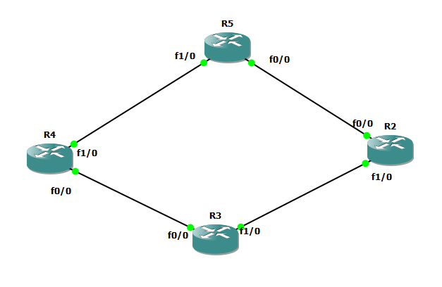

# route filtering : distribute-list + Prefix list




# R4

```
int fa 0/0
no sh
ip addr 10.10.34.4 255.255.255.0


int loop 1
ip addr 10.10.4.1 255.255.255.0
no sh

int loopback 2
ip addr 10.10.44.1 255.255.255.0
no sh


int fa 1/0
no sh
ip addr 10.10.45.4 255.255.255.0


router eigrp my-eig
address-family ipv4 unicast as 1
network 10.10.34.4 0.0.0.0
network 10.10.4.1 0.0.0.0 
network 10.10.44.1 0.0.0.0
network 10.10.45.4 0.0.0.0


! find all /30 subnets

!ip prefix-list mypref30 deny 0.0.0.0/0 ge 30 le 30
!ip prefix-list mypref30 permit 0.0.0.0/0 le 32


!router eigrp my-eig
!address-family ipv4 unicast as 1
!topology base
!distribute-list prefix mypref30 out fastEthernet 0/0


ip prefix-list mypref deny 10.10.44.0/24
ip prefix-list mypref permit 0.0.0.0/0 le 32


router eigrp my-eig
address-family ipv4 unicast as 1
topology base
distribute-list prefix mypref in fastEthernet 0/0


```

# R3

```
int fa 0/0
no sh
ip addr 10.10.34.3 255.255.255.0

int fa 1/0
no sh
ip addr 10.10.23.3 255.255.255.0


int loop 1
ip addr 10.10.3.1 255.255.255.0
no sh

int loopback 2
ip addr 10.10.33.1 255.255.255.0
no sh


router eigrp my-eig
address-family ipv4 unicast as 1
network 10.10.34.3 0.0.0.0
network 10.10.3.1 0.0.0.0 
network 10.10.33.1 0.0.0.0
network 10.10.23.3 0.0.0.0


```


# R2

```
int fa 1/0
no sh
ip addr 10.10.23.2 255.255.255.0


int loop 1
ip addr 10.10.2.1 255.255.255.0
no sh

int loopback 2
ip addr 10.10.22.1 255.255.255.0
no sh


int fa 0/0
no sh
ip addr 10.10.25.2 255.255.255.0


router eigrp my-eig
address-family ipv4 unicast as 1
network 10.10.2.1 0.0.0.0 
network 10.10.22.1 0.0.0.0
network 10.10.23.2 0.0.0.0
network 10.10.25.2 0.0.0.0

```


# R5

```
int fa 0/0
no sh
ip addr 10.10.25.5 255.255.255.0

int fa 1/0
no sh
ip addr 10.10.45.5 255.255.255.0


int loop 1
ip addr 10.10.5.1 255.255.255.0
no sh

int loopback 2
ip addr 10.10.55.1 255.255.255.0
no sh


router eigrp my-eig
address-family ipv4 unicast as 1
network 10.10.45.5 0.0.0.0
network 10.10.25.5 0.0.0.0
network 10.10.55.1 0.0.0.0 
network 10.10.5.1 0.0.0.0


```
