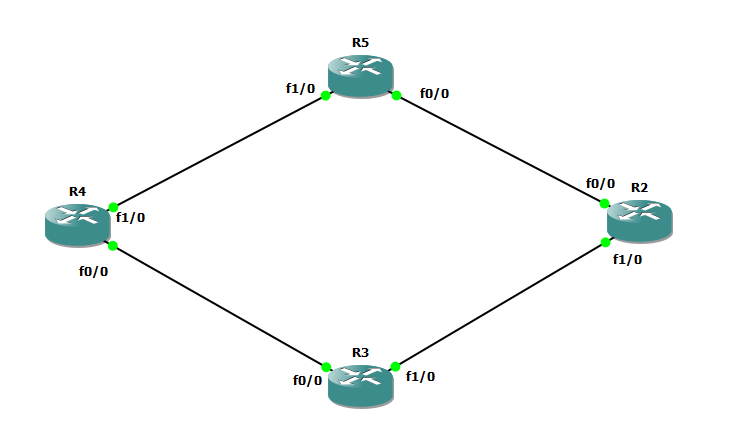

# complete example for eigrp route filtering



# R4 

```
int fa 1/0
no sh
ip addr 10.10.45.4 255.255.255.0

int fa 0/0
no sh
ip addr 10.10.34.4 255.255.255.0


int loopback 0
ip addr 10.10.4.1 255.255.255.0

int loopback 1
ip addr 10.10.44.1 255.255.255.0

router eigrp my-eig
address-family ipv4 unicast as 1
network 10.10.45.4 0.0.0.0
network 10.10.34.4 0.0.0.0
network 10.10.4.1 0.0.0.0
network 10.10.44.1 0.0.0.0


ip access-list standard acl-route-map-eig-filtering
permit 10.10.33.0 0.0.0.255


route-map  myroute-map-filtering deny 10
match ip address acl-route-map-eig-filtering
exit
route-map  myroute-map-filtering permit 11


router eigrp my-eig
address-family ipv4 unicast as 1
topology base
distribute-list route-map myroute-map-filtering  out fastEthernet 1/0

```


# R5 

```
int fa 1/0
no sh
ip addr 10.10.45.5 255.255.255.0

int fa 0/0
no sh
ip addr 10.10.25.5 255.255.255.0


int loopback 0
ip addr 10.10.5.1 255.255.255.0

int loopback 1
ip addr 10.10.55.1 255.255.255.0


router eigrp my-eig
address-family ipv4 unicast as 1
network 10.10.45.5 0.0.0.0
network 10.10.25.5 0.0.0.0
network 10.10.5.1 0.0.0.0
network 10.10.55.1 0.0.0.0


ip access-list standard acl-eigrp-filter
deny 10.10.44.0 0.0.0.255
permit any


router eigrp my-eig
address-family ipv4 unicast as 1
topology base 
distribute-list acl-eigrp-filter out fastEthernet0/0


```


# R2

```
int fa 1/0
no sh
ip addr 10.10.23.2 255.255.255.0

int fa 0/0
no sh
ip addr 10.10.25.2 255.255.255.0


int loopback 0
ip addr 10.10.2.1 255.255.255.0

int loopback 1
ip addr 10.10.22.1 255.255.255.0


router eigrp my-eig
address-family ipv4 unicast as 1
network 10.10.23.2 0.0.0.0
network 10.10.25.2 0.0.0.0
network 10.10.2.1 0.0.0.0
network 10.10.22.1 0.0.0.0


ip prefix-list mypref permit 10.10.25.5/32 

router eigrp my-eig
address-family ipv4 unicast as 1
topology base 
distribute-list gateway mypref in
```


# R3

```
int fa 1/0
no sh
ip addr 10.10.23.3 255.255.255.0

int fa 0/0
no sh
ip addr 10.10.34.3 255.255.255.0


int loopback 0
ip addr 10.10.3.1 255.255.255.0

int loopback 1
ip addr 10.10.33.1 255.255.255.0


router eigrp my-eig
address-family ipv4 unicast as 1
network 10.10.23.3 0.0.0.0
network 10.10.34.3 0.0.0.0
network 10.10.3.1 0.0.0.0
network 10.10.33.1 0.0.0.0


ip prefix-list myprefix deny 10.10.22.0/24
ip prefix-list myprefix permit 0.0.0.0/0 le 32


router eigrp my-eig
address-family ipv4 unicast as 1
topology base 
distribute-list prefix myprefix out fast 0/0


```


