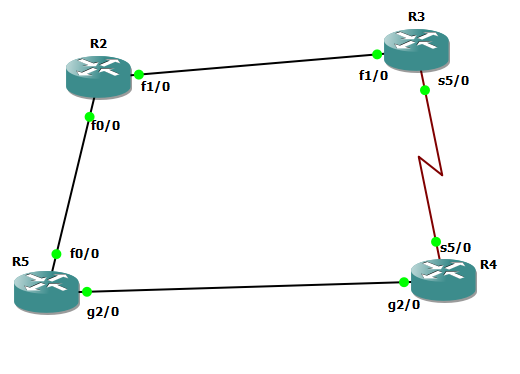

## R2
```
int fa 1/0
ip addr 10.10.23.2 255.255.255.0
no sh

int fa 0/0
ip addr 10.10.25.2 255.255.255.0
no sh


router eigrp 1
eigrp router-id 2.2.2.2
network 10.10.23.2 0.0.0.0
network 10.10.25.2 0.0.0.0


key chain R2-keychain
key 1
key-string test1

do sh key chain

int fa 1/0
ip authentication mode eigrp 1 md5
ip authentication key-chain eigrp 1 R2-keychain

int fa 0/0
ip authentication mode eigrp 1 md5
ip authentication key-chain eigrp 1 R2-keychain
```


## R3

```
int fa 1/0
ip addr 10.10.23.3 255.255.255.0
no sh


int serial 5/0
ip addr 10.10.34.3 255.255.255.0
no sh


router eigrp 1
eigrp router-id 3.3.3.3
network 10.10.23.3 0.0.0.0
network 10.10.34.3 0.0.0.0


sh ip eigrp topology 10.10.45.0 255.255.255.0


key chain R3-keychain
key 1
key-string test1

do sh key chain

int fa 1/0
ip authentication mode eigrp 1 md5
ip authentication key-chain eigrp 1 R3-keychain

int serial 5/0
ip authentication mode eigrp 1 md5
ip authentication key-chain eigrp 1 R3-keychain

```


# R4

```
int gig 2/0
ip addr 10.10.45.4 255.255.255.0
no sh


int serial 5/0
ip addr 10.10.34.4 255.255.255.0
no sh


router eigrp 1
eigrp router-id 4.4.4.4
network 10.10.45.4 0.0.0.0
network 10.10.34.4 0.0.0.0


key chain R4-keychain
key 1
key-string test1

do sh key chain

int gig 2/0
ip authentication mode eigrp 1 md5
ip authentication key-chain eigrp 1 R4-keychain

int serial 5/0
ip authentication mode eigrp 1 md5
ip authentication key-chain eigrp 1 R4-keychain

```


## R5

```
int gig 2/0
ip addr 10.10.45.5 255.255.255.0
no sh

int fa 0/0
ip addr 10.10.25.5 255.255.255.0
no sh


router eigrp 1
eigrp router-id 5.5.5.5
network 10.10.45.5 0.0.0.0
network 10.10.25.5 0.0.0.0


key chain R5-keychain
key 1
key-string test1

do sh key chain

int gig 2/0
ip authentication mode eigrp 1 md5
ip authentication key-chain eigrp 1 R5-keychain

int fa 0/0
ip authentication mode eigrp 1 md5
ip authentication key-chain eigrp 1 R5-keychain


```


