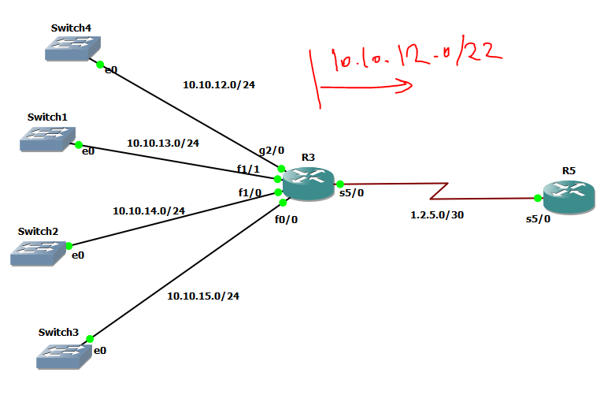

# Route Summerization



# R3 config with classic eigrp (numberd)

```

interface gigabitEthernet 2/0
ip address 10.10.12.1 255.255.255.0
no sh


interface fa 1/1
ip address 10.10.13.1 255.255.255.0
no sh


interface fa 1/0
ip address 10.10.14.1 255.255.255.0
no sh


interface fa 0/0
ip address 10.10.15.1 255.255.255.0
no sh


interface serial 5/0
ip address 1.2.5.1 255.255.255.252
no sh
ip summary-address eigrp 1 10.10.12.0/22


router eigrp 1
network 1.2.5.1 0.0.0.0
network 10.10.15.1 0.0.0.0
network 10.10.14.1 0.0.0.0
network 10.10.13.1 0.0.0.0
network 10.10.12.1 0.0.0.0
summary-metric 10.10.12.0/22 100000 10 255 1 1500 


```


# R3 config Named eigrp (numberd)

```

interface gigabitEthernet 2/0
ip address 10.10.12.1 255.255.255.0
no sh


interface fa 1/1
ip address 10.10.13.1 255.255.255.0
no sh


interface fa 1/0
ip address 10.10.14.1 255.255.255.0
no sh


interface fa 0/0
ip address 10.10.15.1 255.255.255.0
no sh


interface serial 5/0
ip address 1.2.5.1 255.255.255.252
no sh


router eigrp my-eig
address-family ipv4 unicast autonomous-system 1
network 1.2.5.1 0.0.0.0
network 10.10.15.1 0.0.0.0
network 10.10.14.1 0.0.0.0
network 10.10.13.1 0.0.0.0
network 10.10.12.1 0.0.0.0
af-interface serial 5/0
summary-address 10.10.12.0/22
exit 
topology base
summary-metric 10.10.12.0/22 100000 10 255 1 1500 


```


# R5

```

interface serial 5/0
ip address 1.2.5.2 255.255.255.252
no sh


router eigrp 1
network 1.2.5.2 0.0.0.0


```
