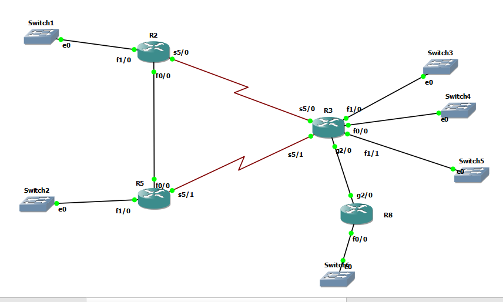

# Eigrp Stub




# R2
```
int fa 1/0
ip addr 10.10.2.1 255.255.255.0
no sh

int serial 5/0
ip addr 10.10.23.2 255.255.255.0
no sh


int fa 0/0
ip addr 10.10.25.2 255.255.255.0
no sh


router eigrp my-eig
address-family ipv4 unicast as 1
network 10.10.25.2 0.0.0.0
network 10.10.23.2 0.0.0.0
network 10.10.2.1 0.0.0.0


```


# R3

```
int fa 0/0
ip addr 10.10.3.1 255.255.255.0
no sh

int fa 1/0
ip addr 10.10.124.1 255.255.255.0
no sh

int fa 1/1
ip addr 10.10.125.1 255.255.255.0
no sh

int serial 5/0
ip addr 10.10.23.3 255.255.255.0
no sh


int serial 5/1
ip addr 10.10.35.3 255.255.255.0
no sh

int gig 2/0
no sh
ip addr 10.10.38.3 255.255.255.0


router eigrp my-eig
address-family ipv4 unicast as 1
eigrp stub connected summary
network 10.10.35.3 0.0.0.0
network 10.10.23.3 0.0.0.0
network 10.10.3.1 0.0.0.0
network 10.10.124.1 0.0.0.0
network 10.10.125.1 0.0.0.0
network 10.10.38.3 0.0.0.0
af-interface serial 5/0
stub-site wan-interface
summary-address 10.10.124.0/23
exit-af-interface 
af-interface serial 5/1
stub-site wan-interface
summary-address 10.10.124.0/23
exit-af-interface
eigrp stub-site 100:1


```


# R5

```
int fa 1/0
ip addr 10.10.5.1 255.255.255.0
no sh

int fast 0/0
ip addr 10.10.25.5 255.255.255.0
no sh


int serial 5/1
ip addr 10.10.35.5 255.255.255.0
no sh


router eigrp my-eig
address-family ipv4 unicast as 1
network 10.10.35.5 0.0.0.0
network 10.10.25.5 0.0.0.0
network 10.10.5.1 0.0.0.0

```

# R8

```

int gig 2/0
no sh
ip addr 10.10.38.8 255.255.255.0

int fa 0/0
no sh
ip addr 10.10.8.1 255.255.255.0


router eigrp my-eig
address-family ipv4 unicast as 1
network 10.10.38.8 0.0.0.0
network 10.10.8.1 0.0.0.0


```
