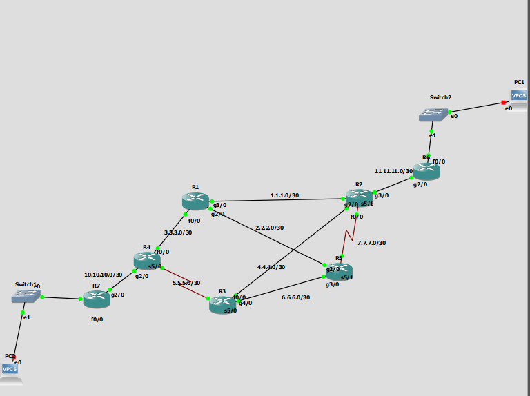

# R1

```
int fa 0/0
no sh
ip address 3.3.3.1 255.255.255.252


int gig 2/0
no sh
ip address 2.2.2.1 255.255.255.252


int gig 3/0
no sh
ip address 1.1.1.1 255.255.255.252


router eigrp 10
eigrp router-id 1.1.1.1
network 3.3.3.0 0.0.0.3
network 2.2.2.0 0.0.0.3
network 1.1.1.0 0.0.0.3


```


# R2

```

int gig 2/0
no sh
ip add 1.1.1.2 255.255.255.252


int fa 0/0
no sh
ip add 4.4.4.2 255.255.255.252

int seri 5/1
no sh
ip add 7.7.7.2 255.255.255.252


int gig 3/0
ip add 11.11.11.2 255.255.255.252
no sh


router eigrp 10
eigrp router-id 2.2.2.2
network 1.1.1.0 0.0.0.3
network 4.4.4.0 0.0.0.3
network 7.7.7.0 0.0.0.3
network 11.11.11.0 0.0.0.3
passive-interface gig 3/0


```


# R3

```

int fa 0/0
no sh
ip add 4.4.4.1 255.255.255.252

int seri 5/0
no sh
ip add 5.5.5.1 255.255.255.252


int gig 4/0
ip add 6.6.6.1 255.255.255.252
no sh


router eigrp 10
eigrp router-id 3.3.3.3
network 4.4.4.0 0.0.0.3
network 5.5.5.0 0.0.0.3
network 6.6.6.0 0.0.0.3


```


# R4

```
int fa 0/0
no sh
ip add 3.3.3.2 255.255.255.252

int seri 5/0
no sh
ip add 5.5.5.2 255.255.255.252


int gig 2/0
ip add 10.10.10.2 255.255.255.252
no sh


router eigrp 10
eigrp router-id 4.4.4.4
network 3.3.3.0 0.0.0.3
network 5.5.5.0 0.0.0.3
network 10.10.10.0 0.0.0.3
passive-interface gig 2/0


```


# R5

```


int seri 5/1
no sh
ip add 7.7.7.1 255.255.255.252


int gig 2/0
ip add 2.2.2.2 255.255.255.252
no sh


int gig 3/0
ip add 6.6.6.2 255.255.255.252
no sh


router eigrp 10
eigrp router-id 5.5.5.5
network 2.2.2.0 0.0.0.3
network 7.7.7.0 0.0.0.3
network 6.6.6.0 0.0.0.3


```


# R6

```


int gig 2/0
ip add 11.11.11.1 255.255.255.252
no sh

ip route 0.0.0.0 0.0.0.0 11.11.11.2


int fa 0/0
no sh
ip add 172.16.20.1 255.255.255.0


ip dhcp pool pol1
network 172.16.20.0 255.255.255.0
default-router 172.16.20.1

exit

ip dhcp excluded-address 172.16.20.1 172.16.20.50


int tun 0
tunnel source 11.11.11.1
tunnel destination 10.10.10.1
ip add 192.168.20.2 255.255.255.0
exit

ip route 192.168.1.0 255.255.255.0 tunnel 0


```


# R7

```
int gig 2/0
ip add 10.10.10.1 255.255.255.252
no sh

ip route 0.0.0.0 0.0.0.0 10.10.10.2


int fa 0/0
no sh
ip add 192.168.1.1 255.255.255.0


ip dhcp pool pol1
network 192.168.1.0 255.255.255.0
default-router 192.168.1.1

exit

ip dhcp excluded-address 192.168.1.1 192.168.1.50


int tun 0
tunnel source 10.10.10.1
tunnel destination 11.11.11.1
ip add 192.168.20.1 255.255.255.0
exit


ip route 172.16.20.0 255.255.255.0 tunnel 0
```