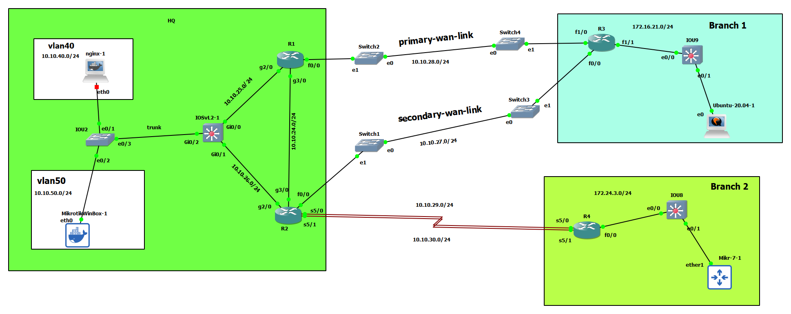

# connection between HQ and Branch with Eigrp




# R2

```
int gig 2/0
no sh
ip addr 10.10.26.2 255.255.255.0


int gig 3/0
no sh
ip addr 10.10.24.2 255.255.255.0


int fa 0/0
no sh
ip addr 10.10.27.2 255.255.255.0


int seri 5/0
no sh
ip addr 10.10.29.2 255.255.255.0


int seri 5/1
no sh
ip addr 10.10.30.2 255.255.255.0


router eigrp myeig
address-family ipv4 unicast as 5
network 10.10.26.2 0.0.0.0
network 10.10.24.2 0.0.0.0
network 10.10.27.2 0.0.0.0
network 10.10.29.2 0.0.0.0
network 10.10.30.2 0.0.0.0


```


# R1

```
int gig 2/0
no sh
ip addr 10.10.25.1 255.255.255.0


int gig 3/0
no sh
ip addr 10.10.24.1 255.255.255.0


int fa 0/0
no sh
ip addr 10.10.28.1 255.255.255.0


router eigrp myeig
address-family ipv4 unicast as 5
network 10.10.25.1 0.0.0.0
network 10.10.24.1 0.0.0.0
network 10.10.28.1 0.0.0.0


```


# iosvl2

```

int gig 0/0
no sh
no switchport
ip addr 10.10.25.5 255.255.255.0


int gig 0/1
no sh
no switchport
ip addr 10.10.26.5 255.255.255.0


int gig 0/2
no sh
switchport trunk encapsulation dot1q
switchport mode trunk

vlan 40,50

int vlan 40
no sh
ip address 10.10.40.1 255.255.255.0


interface vlan 50
no sh
ip address 10.10.50.1 255.255.255.0


router eigrp myeig
address-family ipv4 unicast as 5
network 10.10.25.5 0.0.0.0
network 10.10.26.5 0.0.0.0
network 10.10.40.1 0.0.0.0
network 10.10.50.1 0.0.0.0
af-interface vlan 40
passive-interface
exit-af-interface

af-interface vlan 50
passive-interface
exit-af-interface


```

# IOU2

```

vlan 40,50

int eth 0/3
switchport trunk encapsulation dot1q
switchport mode trunk

interface ethernet 0/2
switchport mode access 
switchport access vlan 50

interface ethernet 0/1
switchport mode access 
switchport access vlan 40


```


# R3-Branch1

```

int fa 1/0
no sh
ip addr 10.10.28.3 255.255.255.0

int fa 0/0
no sh
ip addr	10.10.27.3 255.255.255.0


int fa 1/1
no sh
ip addr 172.16.21.1 255.255.255.0


router eigrp myeig
address-family ipv4 unicast as 5
network 10.10.28.3 0.0.0.0
network 10.10.27.3 0.0.0.0
network 172.16.21.1 0.0.0.0
af-interface fastEthernet 1/1
passive-interface


```


# R4

```

int seri 5/0
no sh
ip addr 10.10.29.4 255.255.255.0


int seri 5/1
no sh
ip addr 10.10.30.4 255.255.255.0
no sh


int fa 0/0
no sh
ip addr 172.24.3.1 255.255.255.0


router eigrp myeig
address-family ipv4 unicast as 5
network 10.10.29.4 0.0.0.0
network 10.10.30.4 0.0.0.0
network 172.24.3.1 0.0.0.0
af-interface fastEthernet 0/0
passive-interface


```

