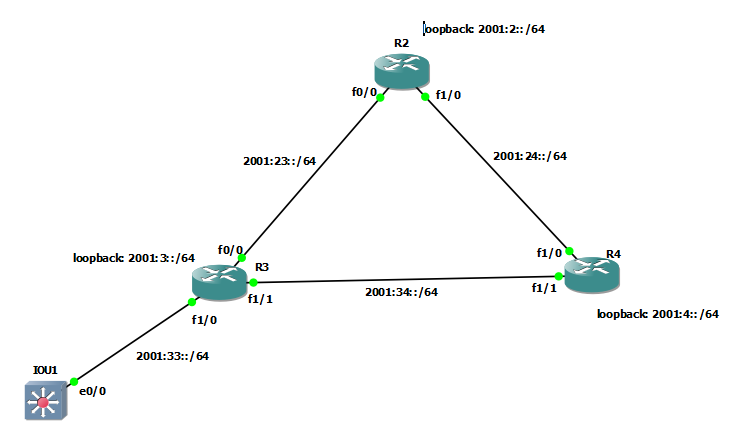

#### R2
```
ipv6 unicast-routing


interface fastEthernet 0/0
no sh
ipv6 address 2001:23::2/64
exit


interface fastEthernet 1/0
no sh
ipv6 address 2001:24::2/64
exit


int loopback0
ipv6 address 2001:2::1/64
exit


ipv6 router eigrp 1
eigrp router-id 2.2.2.2
!passive-interface gig 2/0
exit

interface fastEthernet 0/0
ipv6 eigrp 1
exit

interface fastEthernet 1/0
ipv6 eigrp 1
exit

interface loopback0
ipv6 eigrp 1
exit


do sh ipv6 protocol
do sh ipv6 eigrp interfaces
do sh ipv6 eigrp interfaces detail
do sh ipv6 eigrp neighbors
do sh ipv6 eigrp topology all-links

```


### R3

```

ipv6 unicast-routing


interface fastEthernet 0/0
no sh
ipv6 address 2001:23::3/64
exit


interface fastEthernet 1/1
no sh
ipv6 address 2001:34::3/64
exit


interface fastEthernet 1/0
no sh
ipv6 address 2001:33::1/64
exit


int loopback0
ipv6 address 2001:3::1/64
exit


router eigrp my-eig
address-family ipv6 unicast autonomous-system 1
eigrp router-id 3.3.3.3
af-interface fastEthernet 1/0
passive-interface


```


### R4

```

ipv6 unicast-routing


interface fastEthernet 1/0
no sh
ipv6 address 2001:24::4/64
exit


interface fastEthernet 1/1
no sh
ipv6 address 2001:34::4/64
exit


int loopback0
ipv6 address 2001:4::1/64
exit


router eigrp my-eig
address-family ipv6 unicast autonomous-system 1
eigrp router-id 4.4.4.4


```


