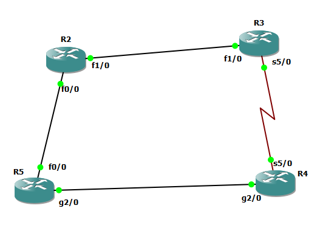

## R2
```
int fa 1/0
ip addr 10.10.23.2 255.255.255.0
no sh

int fa 0/0
ip addr 10.10.25.2 255.255.255.0
no sh


router eigrp my-eig-1
address-family ipv4 unicast autonomous-system 8
network 10.10.23.2 0.0.0.0
network 10.10.25.2 0.0.0.0

af-interface fast 1/0
authentication mode hmac-sha-256 test
hello-interval 10
hold-time 40
exit-af-interface

af-interface fa 0/0
authentication mode hmac-sha-256 test
hello-interval 10
hold-time 40
exit-af-interface


```


## R3

```
int fa 1/0
ip addr 10.10.23.3 255.255.255.0
no sh


int serial 5/0
ip addr 10.10.34.3 255.255.255.0
no sh


router eigrp my-eig-1
address-family ipv4 unicast autonomous-system 8
network 10.10.23.3 0.0.0.0
network 10.10.34.3 0.0.0.0

af-interface fa 1/0
authentication mode hmac-sha-256 test
hello-interval 10
hold-time 40
exit-af-interface

af-interface serial 5/0
authentication mode hmac-sha-256 test
hello-interval 10
hold-time 40
exit-af-interface


sh ip eigrp topology 10.10.45.0 255.255.255.0


```


# R4

```
int gig 2/0
ip addr 10.10.45.4 255.255.255.0
no sh


int serial 5/0
ip addr 10.10.34.4 255.255.255.0
no sh


router eigrp my-eig-1
address-family ipv4 unicast autonomous-system 8
network 10.10.45.4 0.0.0.0
network 10.10.34.4 0.0.0.0

af-interface gig 2/0
authentication mode hmac-sha-256 test
hello-interval 10
hold-time 40
exit-af-interface

af-interface serial 5/0
authentication mode hmac-sha-256 test
hello-interval 10
hold-time 40
exit-af-interface


```


## R5

```
int gig 2/0
ip addr 10.10.45.5 255.255.255.0
no sh

int fa 0/0
ip addr 10.10.25.5 255.255.255.0
no sh


router eigrp my-eig-1
address-family ipv4 unicast autonomous-system 8
network 10.10.45.5 0.0.0.0
network 10.10.25.5 0.0.0.0


af-interface fa 0/0
authentication mode hmac-sha-256 test
hello-interval 10
hold-time 40
exit-af-interface

af-interface gig 2/0
authentication mode hmac-sha-256 test
hello-interval 10
hold-time 40
exit-af-interface


```


