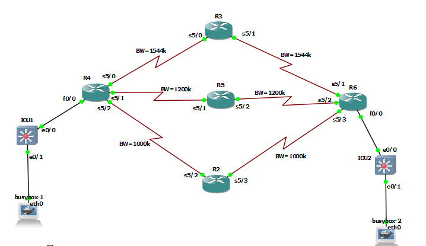

## Eigrp Convergence



## R4
```
interface serial 5/0
ip address 10.10.34.4 255.255.255.0
no sh


interface serial 5/1
ip address 10.10.45.4 255.255.255.0
no sh
bandwidth 1200
exit


interface serial 5/2
ip address 10.10.24.4 255.255.255.0
no sh
bandwidth 1000
exit


interface fastEthernet 0/0
no sh
ip address 10.10.4.1 255.255.255.0


router eigrp 1
eigrp router-id 4.4.4.4
network 10.10.4.1 0.0.0.0
network 10.10.24.4 0.0.0.0
network 10.10.45.4 0.0.0.0
network 10.10.34.4 0.0.0.0
passive-interface fastEthernet 0/0
timers active-time 2
```

## R3

```
interface serial 5/0
ip address 10.10.34.3 255.255.255.0
no sh


interface serial 5/1
ip address 10.10.36.3 255.255.255.0
no sh
exit


router eigrp 1
eigrp router-id 3.3.3.3
network 10.10.34.3 0.0.0.0
network 10.10.36.3 0.0.0.0
timers active-time 2


```

## R5
```
interface serial 5/1
ip address 10.10.45.5 255.255.255.0
no sh
bandwidth 1200
exit


interface serial 5/2
ip address 10.10.56.5 255.255.255.0
no sh
bandwidth 1200
exit


router eigrp 1
eigrp router-id 5.5.5.5
network 10.10.45.5 0.0.0.0
network 10.10.56.5 0.0.0.0
timers active-time 2

```

## R2

```
interface serial 5/2
ip address 10.10.24.2 255.255.255.0
no sh
bandwidth 1000
exit


interface serial 5/3
ip address 10.10.26.2 255.255.255.0
no sh
bandwidth 1000
exit

router eigrp 1
eigrp router-id 2.2.2.2
network 10.10.24.2 0.0.0.0
network 10.10.26.2 0.0.0.0
timers active-time 2

```


## R6
```
interface serial 5/1
ip address 10.10.36.6 255.255.255.0
no sh


interface serial 5/2
ip address 10.10.56.6 255.255.255.0
no sh
bandwidth 1200
exit


interface serial 5/3
ip address 10.10.26.6 255.255.255.0
no sh
bandwidth 1000
exit


interface fastEthernet 0/0
no sh
ip address 10.10.6.1 255.255.255.0

router eigrp 1
eigrp router-id 6.6.6.6
network 10.10.6.1 0.0.0.0
network 10.10.26.6 0.0.0.0
network 10.10.56.6  0.0.0.0
network 10.10.36.6 0.0.0.0
passive-interface fastEthernet 0/0
timers active-time 2

```


