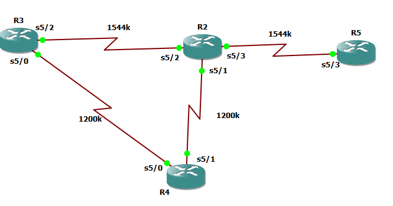

## Config




## R3
```
int serial 5/2
no sh
ip address 10.10.23.3 255.255.255.0


int serial 5/0
no sh
ip address 10.10.34.3 255.255.255.0
bandwidth 1200


router eigrp my-eig
address-family ipv4 unicast autonomous-system 1
network 10.10.23.3 0.0.0.0
network 10.10.34.3 0.0.0.0
```


## R2
```
int serial 5/2
no sh
ip address 10.10.23.2 255.255.255.0


int serial 5/1
no sh
ip address 10.10.24.2 255.255.255.0
bandwidth 1200


int serial 5/3
no sh
ip address 10.10.25.2 255.255.255.0


router eigrp my-eig
address-family ipv4 autonomous-system 1
network 10.10.23.2 0.0.0.0
network 10.10.25.2 0.0.0.0
network 10.10.24.2 0.0.0.0

```


## R4

```

int serial 5/0
no sh
ip address 10.10.34.4 255.255.255.0


int serial 5/1
no sh
ip address 10.10.24.4 255.255.255.0
bandwidth 1200

router eigrp my-eig
address-family ipv4 autonomous-system 1
network 10.10.34.4 0.0.0.0
network 10.10.24.4 0.0.0.0

```

## R5

```

int serial 5/3
no sh
ip address 10.10.25.5 255.255.255.0


int loopback0 
ip addr 10.10.5.1 255.255.255.0

router eigrp my-eig
address-family ipv4 autonomous-system 1
network 10.10.25.5 0.0.0.0
network 10.10.5.1 0.0.0.0


```