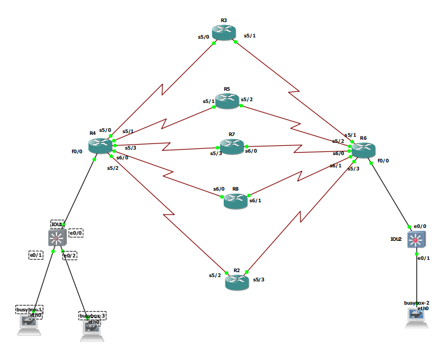
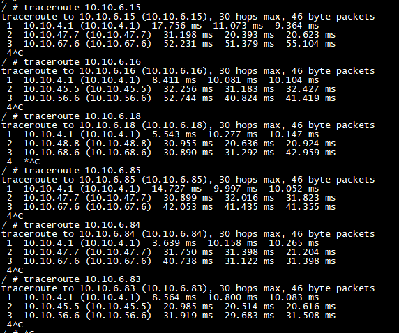

# Equal LoadBalancing




## R4
```
interface serial 5/0
ip address 10.10.34.4 255.255.255.0
no sh
exit


interface serial 5/1
ip address 10.10.45.4 255.255.255.0
no sh
exit

interface serial 5/3
ip address 10.10.47.4 255.255.255.0
no sh
exit

interface serial 6/0
ip address 10.10.48.4 255.255.255.0
no sh
exit


interface serial 5/2
ip address 10.10.24.4 255.255.255.0
no sh
exit


interface fast 0/0
ip address 10.10.4.1 255.255.255.0
no sh
exit


router eigrp 1
eigrp router-id 4.4.4.4
network 10.10.4.1 0.0.0.0
network 10.10.24.4 0.0.0.0
network 10.10.48.4 0.0.0.0
network 10.10.47.4 0.0.0.0
network 10.10.45.4 0.0.0.0
network 10.10.34.4 0.0.0.0
passive-interface fastEthernet 0/0
maximum-paths 5  
```

## R3

```

interface serial 5/0
ip address 10.10.34.3 255.255.255.0
no sh
exit


interface serial 5/1
ip address 10.10.36.3 255.255.255.0
no sh
exit


router eigrp 1
eigrp router-id 3.3.3.3
network 10.10.36.3 0.0.0.0
network 10.10.34.3 0.0.0.0


```

## R5

```

interface serial 5/1
ip address 10.10.45.5 255.255.255.0
no sh
exit


interface serial 5/2
ip address 10.10.56.5 255.255.255.0
no sh
exit

router eigrp 1
eigrp router-id 5.5.5.5
network 10.10.45.5 0.0.0.0
network 10.10.56.5 0.0.0.0


```


## R7

```

interface serial 5/3
ip address 10.10.47.7 255.255.255.0
no sh
exit


interface serial 6/0
ip address 10.10.67.7 255.255.255.0
no sh
exit

router eigrp 1
eigrp router-id 7.7.7.7
network 10.10.47.7 0.0.0.0
network 10.10.67.7 0.0.0.0


```


## R8

```

interface serial 6/0
ip address 10.10.48.8 255.255.255.0
no sh
exit


interface serial 6/1
ip address 10.10.68.8 255.255.255.0
no sh
exit

router eigrp 1
eigrp router-id 8.8.8.8
network 10.10.48.8 0.0.0.0
network 10.10.68.8 0.0.0.0


```

## R2

```

interface serial 5/2
ip address 10.10.24.2 255.255.255.0
no sh
exit


interface serial 5/3
ip address 10.10.26.2 255.255.255.0
no sh
exit


router eigrp 1
eigrp router-id 2.2.2.2
network 10.10.24.2 0.0.0.0
network 10.10.26.2 0.0.0.0


```


## R6

```
interface serial 5/1
ip address 10.10.36.6 255.255.255.0
no sh
exit

interface serial 5/2
ip address 10.10.56.6 255.255.255.0
no sh
exit


interface serial 6/0
ip address 10.10.67.6 255.255.255.0
no sh
exit


interface serial 6/1
ip address 10.10.68.6 255.255.255.0
no sh
exit


interface serial 5/3
ip address 10.10.26.6 255.255.255.0
no sh
exit

interface fast 0/0
ip address 10.10.6.1 255.255.255.0
no sh
exit


router eigrp my-eig
address-family ipv4 unicast autonomous-system 1
eigrp router-id 6.6.6.6
network 10.10.6.1 0.0.0.0
network 10.10.26.6 0.0.0.0
network 10.10.68.6 0.0.0.0
network 10.10.67.6 0.0.0.0
network 10.10.56.6 0.0.0.0
network 10.10.36.6 0.0.0.0
topology base
maximum-paths 5
exit-af-topology
af-interface fastEthernet 0/0
passive-interface


```

## Results
