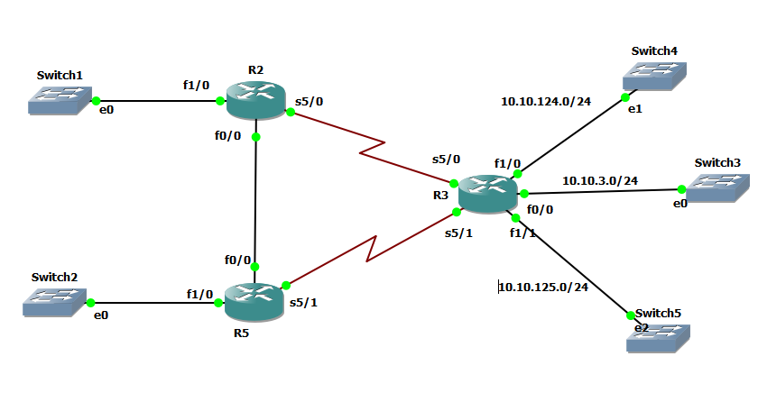
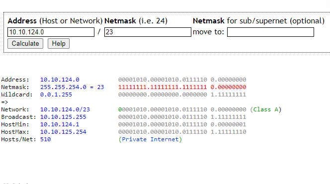
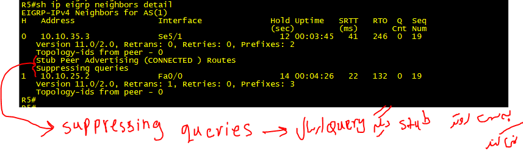

# R2





```
int fa 1/0
ip addr 10.10.2.1 255.255.255.0
no sh

int serial 5/0
ip addr 10.10.23.2 255.255.255.0
no sh


int fa 0/0
ip addr 10.10.25.2 255.255.255.0
no sh

router eigrp 1
eigrp router-id 2.2.2.2
network 10.10.25.2 0.0.0.0
network 10.10.23.2 0.0.0.0
network 10.10.2.1 0.0.0.0


```


# R3

```
int fa 0/0
ip addr 10.10.3.1 255.255.255.0
no sh

int fa 1/0
ip addr 10.10.124.1 255.255.255.0
no sh

int fa 1/1
ip addr 10.10.125.1 255.255.255.0
no sh

int serial 5/0
ip addr 10.10.23.3 255.255.255.0
no sh


int serial 5/1
ip addr 10.10.35.3 255.255.255.0
no sh


router eigrp 1
eigrp router-id 3.3.3.3
network 10.10.35.3 0.0.0.0
network 10.10.23.3 0.0.0.0
network 10.10.3.1 0.0.0.0
network 10.10.124.1 0.0.0.0
network 10.10.125.1 0.0.0.0

eigrp stub connected summary 


int serial 5/0
ip summary-address eigrp 1 10.10.124.0/23


```



# R5

```
int fa 1/0
ip addr 10.10.5.1 255.255.255.0
no sh

int fast 0/0
ip addr 10.10.25.5 255.255.255.0
no sh


int serial 5/1
ip addr 10.10.35.5 255.255.255.0
no sh

router eigrp 1
eigrp router-id 5.5.5.5
network 10.10.35.5 0.0.0.0
network 10.10.25.5 0.0.0.0
network 10.10.5.1 0.0.0.0

```


