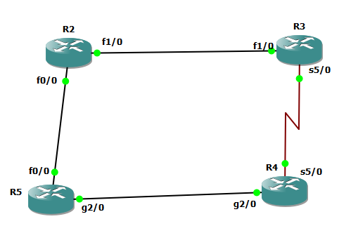

# R2

```
interface fastEthernet 1/0
no sh
ip address 10.10.23.2 255.255.255.0


interface fastEthernet 0/0
no sh
ip address 10.10.25.2 255.255.255.0

router eigrp 1
network 10.10.25.2 0.0.0.0
network 10.10.23.2 0.0.0.0

key chain test
key 1
key-string secure

int fa 0/0
ip authentication mode eigrp 1 md5 
ip authentication key-chain eigrp 1 test

int fa 1/0
ip authentication mode eigrp 1 md5 
ip authentication key-chain eigrp 1 test


```


# R5

```
interface gig 2/0
no sh
ip address 10.10.45.5 255.255.255.0


interface fastEthernet 0/0
no sh
ip address 10.10.25.5 255.255.255.0

key chain test
key 1
key-string secure


router eigrp my-eig
address-family ipv4 unicast autonomous-system 1
network 10.10.25.5 0.0.0.0
network 10.10.45.5 0.0.0.0

af-interface gig 2/0
authentication mode md5
authentication key-chain test
exit-af-interface

af-interface fastEthernet 0/0
authentication mode md5
authentication key-chain test
exit-af-interface

```


# R3

```
interface fastEthernet 1/0
no sh
ip address 10.10.23.3 255.255.255.0


interface serial 5/0
no sh
ip address 10.10.34.3 255.255.255.0


key chain test
key 1
key-string secure


router eigrp my-eig
address-family ipv4 unicast autonomous-system 1
network 10.10.34.3 0.0.0.0
network 10.10.23.3 0.0.0.0

af-interface fastEthernet 1/0
authentication mode md5
authentication key-chain test
exit-af-interface

af-interface serial 5/0
authentication mode md5
authentication key-chain test
exit-af-interface


```


# R4

```
interface gig 2/0
no sh
ip address 10.10.45.4 255.255.255.0


interface serial 5/0
no sh
ip address 10.10.34.4 255.255.255.0


router eigrp 1
network 10.10.34.4 0.0.0.0
network 10.10.45.4 0.0.0.0


key chain test
key 1
key-string secure

int serial 5/0
ip authentication mode eigrp 1 md5 
ip authentication key-chain eigrp 1 test

int gig 2/0
ip authentication mode eigrp 1 md5 
ip authentication key-chain eigrp 1 test


```