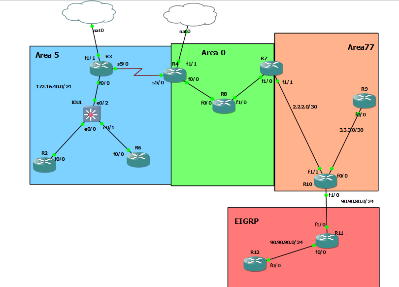

## R3
```
interface fastEthernet 0/0
no sh
ip address 172.16.40.3 255.255.255.0


interface serial 5/0
no sh
ip address 10.10.34.3 255.255.255.0


interface FastEthernet1/1
no sh
ip address 10.10.122.3 255.255.255.0


ip route 0.0.0.0 0.0.0.0 10.10.122.1


router ospf 1
router-id 3.3.3.3
network 172.16.40.3 0.0.0.0 area 5
network 10.10.34.3 0.0.0.0 area 5
default-information originate metric 3


sh ip protocols


```

## R2
```
interface fastEthernet 0/0
no sh
ip address 172.16.40.2 255.255.255.0


router ospf 1
router-id 2.2.2.2
network 172.16.40.2 0.0.0.0 area 5


sh ip protocols


```


## R6
```
interface fastEthernet 0/0
no sh
ip address 172.16.40.6 255.255.255.0


router ospf 1
router-id 6.6.6.6
network 172.16.40.6 0.0.0.0 area 5


int loopback 0
ip addr 10.10.6.1 255.255.255.0
ip ospf 1 area 5


```


## R4
```
interface fastEthernet 0/0
no sh
ip address 10.10.48.4 255.255.255.0


interface serial 5/0
no sh
ip address 10.10.34.4 255.255.255.0


interface FastEthernet1/1
no sh
ip address 10.10.122.100 255.255.255.0


ip route 0.0.0.0 0.0.0.0 10.10.122.1

router ospf 1
router-id 4.4.4.4
network 10.10.48.4 0.0.0.0 area 0
network 10.10.34.4 0.0.0.0 area 5
default-information originate metric 4


```


## R8
```
interface fastEthernet 0/0
no sh
ip address 10.10.48.8 255.255.255.0


interface fastEthernet 1/0
no sh
ip address 10.10.78.8 255.255.255.0


router ospf 1
router-id 8.8.8.8
network 10.10.48.8 0.0.0.0 area 0
network 10.10.78.8 0.0.0.0 area 0


```


## R7
```
interface fastEthernet 1/1
no sh
ip address 2.2.2.1 255.255.255.252


interface fastEthernet 1/0
no sh
ip address 10.10.78.7 255.255.255.0


router ospf 1
router-id 7.7.7.7
network 2.2.2.1 0.0.0.0 area 77
network 10.10.78.7 0.0.0.0 area 0


```


## R10
```
interface fastEthernet 1/1
no sh
ip address 2.2.2.2 255.255.255.252


interface fastEthernet 0/0
no sh
ip address 3.3.3.1 255.255.255.252


interface fastEthernet 1/0
no sh
ip address 90.90.80.10 255.255.255.0


router ospf 1
router-id 10.10.10.10
network 2.2.2.2 0.0.0.0 area 77
network 3.3.3.1 0.0.0.0 area 77


router eigrp 1
network 90.90.80.10 0.0.0.0


router ospf 1
redistribute eigrp 1 subnets
```


## R9
```


interface fastEthernet 0/0
no sh
ip address 3.3.3.2 255.255.255.252


router ospf 1
router-id 9.9.9.9
network 3.3.3.2 0.0.0.0 area 77


int loopback 0
ip addr 10.10.9.1 255.255.255.0
ip ospf 1 area 77


```

# R11

```
interface fastEthernet 0/0
no sh
ip address 90.90.90.11 255.255.255.0


interface fastEthernet 1/0
no sh
ip address 90.90.80.11 255.255.255.0


router eigrp 1
network 90.90.90.11 0.0.0.0
network 90.90.80.11 0.0.0.0

```


# R12

```
interface fastEthernet 0/0
no sh
ip address 90.90.90.12 255.255.255.0


int loopback 0
ip addr 10.10.12.1 255.255.255.0

int loopback 1
ip addr 10.20.12.1 255.255.255.0


router eigrp 1
network 90.90.90.12 0.0.0.0
network 10.10.12.1 0.0.0.0
network 10.20.12.1 0.0.0.0

```