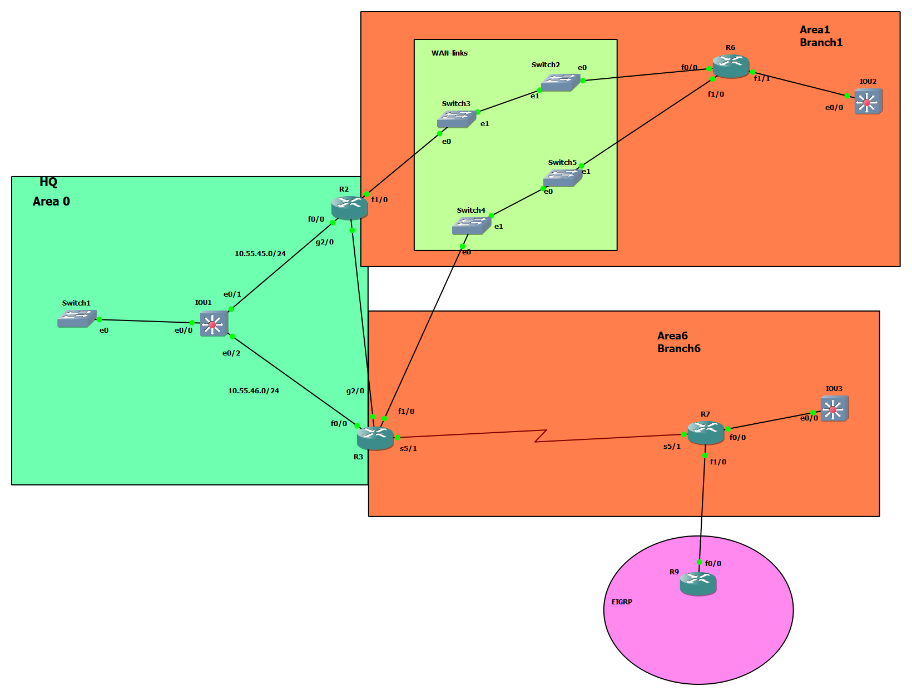

# ospf redistrubte - E1, E2




# IOU1

```
int eth 0/1
no sh
no switchport
ip add 10.55.45.1 255.255.255.0

int eth 0/2
no sh
no switchport
ip addr 10.55.46.1 255.255.255.0


vlan 10,20,30,40
exit

int vlan 10
no sh
ip addr 10.10.10.1 255.255.255.0

int vlan 20
no sh
ip addr 10.10.20.1 255.255.255.0


int vlan 30
no sh
ip addr 10.10.30.1 255.255.255.0

int vlan 40
no sh
ip addr 10.10.40.1 255.255.255.0

int eth 0/0
switchport trunk encapsulation dot1q
switchport mode trunk


router ospf 1
router-id 15.15.15.15
network 10.55.45.1 0.0.0.0 area 0
network 10.55.46.1 0.0.0.0 area 0
network 10.10.10.1 0.0.0.0 area 0
network 10.10.20.1 0.0.0.0 area 0
network 10.10.30.1 0.0.0.0 area 0
network 10.10.40.1 0.0.0.0 area 0
area 0 authentication message-digest
passive-interface default
no passive-interface ethernet 0/1
no passive-interface ethernet 0/2
exit


int eth 0/1
ip ospf message-digest-key 1 md5 secure-pass
ip ospf network point-to-point

int eth 0/2
ip ospf message-digest-key 1 md5 secure-pass
ip ospf network point-to-point

```


# R3

```
int fa 0/0
no sh
ip addr 10.55.46.3 255.255.255.0


int gig 2/0
no sh
ip addr 10.10.23.3 255.255.255.0

int fa 1/0
no sh
ip addr 10.10.36.3 255.255.255.0


int seri 5/1
no sh
ip addr 10.10.37.3 255.255.255.0


router ospf 1
router-id 3.3.3.3
network 10.55.46.3 0.0.0.0 area 0
network 10.10.23.3 0.0.0.0 area 0
network 10.10.36.3 0.0.0.0 area 1
network 10.10.37.3 0.0.0.0 area 6
area 0 authentication message-digest
area 1 authentication message-digest
area 6 authentication message-digest
exit


int fa 0/0
ip ospf message-digest-key 1 md5 secure-pass
ip ospf network point-to-point 

int fa 1/0
ip ospf message-digest-key 1 md5 secure-pass
ip ospf network point-to-point 

int gig 2/0
ip ospf message-digest-key 1 md5 secure-pass
ip ospf network point-to-point 

int serial 5/1
ip ospf message-digest-key 1 md5 secure-pass
ip ospf network point-to-point 


```


# R2 

```
int fa 0/0
no sh
ip addr 10.55.45.2 255.255.255.0


int gig 2/0
no sh
ip addr 10.10.23.2 255.255.255.0


int fa 1/0
no sh
ip addr 10.10.26.2 255.255.255.0


router ospf 1
router-id 2.2.2.2
network 10.55.45.2 0.0.0.0 area 0
network 10.10.23.2 0.0.0.0 area 0
network 10.10.26.2 0.0.0.0 area 1
area 0 authentication message-digest
area 1 authentication message-digest
exit


int fa 0/0
ip ospf message-digest-key 1 md5 secure-pass
ip ospf network point-to-point 

int fa 1/0
ip ospf message-digest-key 1 md5 secure-pass
ip ospf network point-to-point 

int gig 2/0
ip ospf message-digest-key 1 md5 secure-pass
ip ospf network point-to-point 


```


# R6

```
int fa 0/0
no sh 
ip addr 10.10.26.6 255.255.255.0

int fa 1/0
no sh
ip addr 10.10.36.6 255.255.255.0

int fa 1/1
no sh
ip addr 10.10.6.1 255.255.255.0


router ospf 1
router-id 6.6.6.6
network 10.10.26.6 0.0.0.0 area 1
network 10.10.36.6 0.0.0.0 area 1
network 10.10.6.1 0.0.0.0 area 1
area 1 authentication message-digest
passive-interface fastEthernet 1/1
exit


int fa 0/0
ip ospf message-digest-key 1 md5 secure-pass
ip ospf network point-to-point 


int fa 1/0
ip ospf message-digest-key 1 md5 secure-pass
ip ospf network point-to-point 


```


# R7
```

int seri 5/1
no sh
ip addr 10.10.37.7 255.255.255.0


int fa 0/0
no sh
ip addr 10.10.7.1 255.255.255.0


router ospf 1
router-id 7.7.7.7
network 10.10.37.7 0.0.0.0 area 6
network 10.10.7.1 0.0.0.0 area 6
area 6 authentication message-digest
passive-interface fastEthernet 0/0
exit


int seri 5/1
ip ospf message-digest-key 1 md5 secure-pass
ip ospf network point-to-point 


int fa 1/0
no sh
ip addr 10.10.79.7 255.255.255.0


router eigrp 1
network 10.10.79.7 0.0.0.0


!router ospf 1
!redistribute eigrp 1 subnets metric-type 1 metric 150


router ospf 1
redistribute eigrp 1 subnets metric-type 2 metric 150

```


# R9

```
int fa 0/0
no sh
ip addr 10.10.79.9 255.255.255.0


int loopback 0
ip addr 10.10.9.1 255.255.255.0


int loopback1
ip addr 10.10.99.1 255.255.255.0


router eigrp 1
network 10.10.79.9 0.0.0.0
network 10.10.9.1 0.0.0.0
network 10.10.99.1 0.0.0.0


```