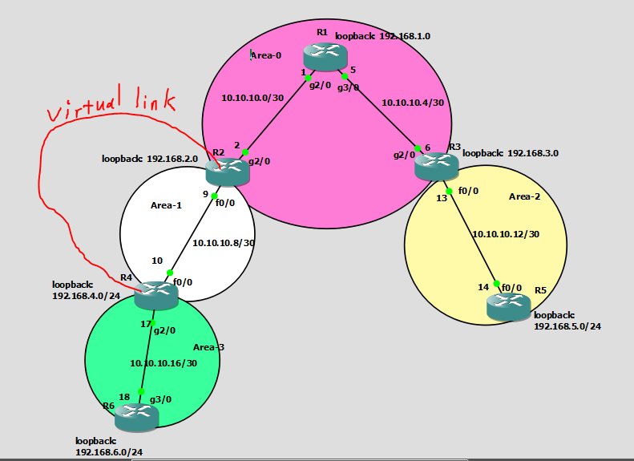

# R1

```
int loopback 0
ip addr 192.168.1.1 255.255.255.0
no sh


interface gigabitEthernet 2/0
no sh
ip address 10.10.10.1 255.255.255.252


interface gigabitEthernet 3/0
no sh
ip address 10.10.10.5 255.255.255.252


router ospf 1
router-id 1.1.1.1
network 192.168.1.0 0.0.0.255 area 0
network 10.10.10.0 0.0.0.3 area 0
network 10.10.10.4 0.0.0.3 area 0
auto-cost reference-bandwidth 10000
clear ip ospf process
do sh run | sec ospf
```


# R2
```
int loopback 0
ip addr 192.168.2.1 255.255.255.0
no sh


interface gigabitEthernet 2/0
no sh
ip address 10.10.10.2 255.255.255.252


interface fastEthernet 0/0
no sh
ip address 10.10.10.9 255.255.255.252


router ospf 1
router-id 2.2.2.2
network 192.168.2.0 0.0.0.255 area 0
network 10.10.10.0 0.0.0.3 area 0
network 10.10.10.8 0.0.0.3 area 1
area 1 virtual-link 4.4.4.4
auto-cost reference-bandwidth 10000
clear ip ospf process
do sh run | sec ospf


```


# R3
```

int loopback 0
ip addr 192.168.3.1 255.255.255.0
no sh


interface gigabitEthernet 2/0
no sh
ip address 10.10.10.6 255.255.255.252


interface fastEthernet 0/0
no sh
ip address 10.10.10.13 255.255.255.252


router ospf 1
router-id 3.3.3.3
network 192.168.3.0 0.0.0.255 area 0
network 10.10.10.4 0.0.0.3 area 0
network 10.10.10.12 0.0.0.3 area 2
auto-cost reference-bandwidth 10000
clear ip ospf process
do sh run | sec ospf


```


# R4 

```
int loopback 0
ip addr 192.168.4.1 255.255.255.0
no sh


interface fa 0/0
no sh
ip address 10.10.10.10 255.255.255.252

interface gigabitEthernet 2/0
no sh
ip address 10.10.10.17 255.255.255.252


router ospf 1
router-id 4.4.4.4
network 10.10.10.8 0.0.0.3 area 1
network 192.168.4.0 0.0.0.255 area 1
network 10.10.10.16 0.0.0.3 area 3
auto-cost reference-bandwidth 10000
clear ip ospf process
area 1 virtual-link 2.2.2.2

```

# R5
```

int loopback 0
ip addr 192.168.5.1 255.255.255.0
no sh


interface fastEthernet 0/0
no sh
ip address 10.10.10.14 255.255.255.252


router-id 5.5.5.5
network 192.168.5.0 0.0.0.255 area 2
network 10.10.10.12 0.0.0.3 area 2
auto-cost reference-bandwidth 10000
clear ip ospf process


```


# R6

```
interface gigabitEthernet 3/0
no sh
ip address 10.10.10.18 255.255.255.252

int loopback 0
ip addr 192.168.6.1 255.255.255.0
no sh


router ospf 1
router-id 6.6.6.6
network 192.168.6.0 0.0.0.255 area 3
network 10.10.10.16 0.0.0.3 area 3
auto-cost reference-bandwidth 10000
clear ip ospf process

```