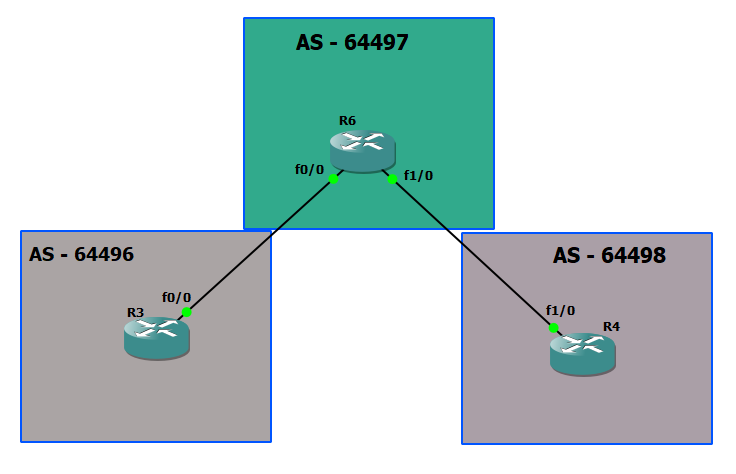

# BGP




# R3

```

int fa 0/0
ip addr 10.10.36.3 255.255.255.0
no sh


router bgp 64496
bgp router-id 3.3.3.3
neighbor 10.10.36.6 remote-as 64497


sh tcp brief 
```


# R6

```

int fa 0/0
ip addr 10.10.36.6 255.255.255.0
no sh


int fa 1/0
ip addr 10.10.46.6 255.255.255.0
no sh


router bgp 64497
bgp router-id 6.6.6.6
neighbor 10.10.36.3 remote-as 64496
neighbor 10.10.46.4 remote-as 64498
neighbor 10.10.46.4 password iman-secret

sh tcp brief 

```

# R4

```

int fa 1/0
ip addr 10.10.46.4 255.255.255.0
no sh


router bgp 64498
bgp router-id 4.4.4.4
no bgp default ipv4-unicast 
neighbor 10.10.46.6 remote-as 64497
neighbor 10.10.46.6 password iman-secret
address-family ipv4 unicast
neighbor 10.10.46.6 description toas-64497
!neighbor 10.10.46.6 shutdown
!neighbor 10.10.46.6 activate 


clear ip bgp *

sh tcp brief 
sh ip bgp neighbors
sh bgp ipv4 unicast neighbors
sh ip bgp summary

```